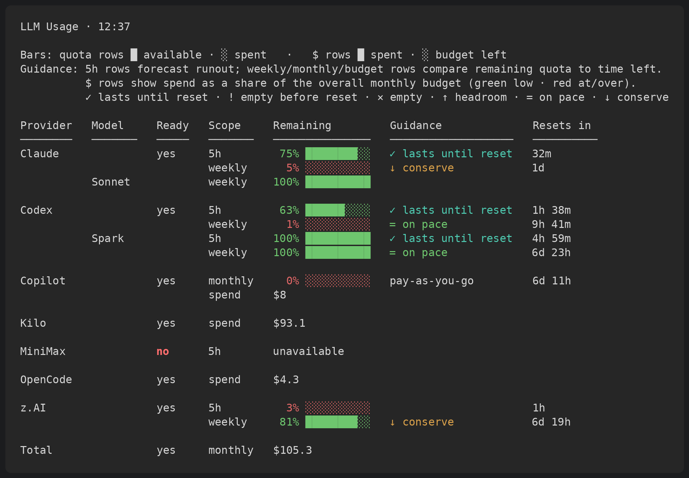

# llm-tools


[](https://github.com/chrisgleissner/llm-tools/actions/workflows/test.yml)
[](https://codecov.io/gh/chrisgleissner/llm-tools)
[](https://www.apache.org/licenses/LICENSE-2.0)
[](https://github.com/chrisgleissner/llm-tools/releases)

`llm-tools` is a small set of command-line tools for staying on top of local LLM provider capacity: session windows, weekly limits, quotas, credit balances, cost budgets, and provider availability.

The goal is to make LLM CLI work **more observable and less wasteful**. You can see which providers still have capacity, avoid burning weekly limits blindly, and dispatch tasks as soon as a provider becomes usable again instead of leaving open session windows idle.

The tools are intentionally **local- and CLI-first**. Instead of introducing another authentication layer, they use the provider CLIs you already have installed and authenticated. Credentials stay with those tools, and normal use remains zero-config.

Supported providers include: **Codex, Claude Code, GitHub Copilot, Kilo Code, MiniMax, OpenCode, and z.AI**.

## Tools at a Glance

| Command         | Use it when you want to...                                                                       |
| --------------- | ------------------------------------------------------------------------------------------------ |
| `llm-usage`      | Check remaining LLM capacity before starting work.                                               |
| `llm-scheduler`  | Run one prompt through one selected provider once that provider has usable capacity.             |
| `ralph-robin`    | Keep autonomous work moving by rotating across providers instead of stopping at the first limit. |
| `llm-sleep-soak` | Prove suspend/resume is reliable on this machine before trusting unattended overnight runs.      |



## Install

Install with [pipx](https://pipx.pypa.io):

```bash
pipx install git+https://github.com/chrisgleissner/llm-tools.git
```

This puts the commands on your `PATH` and keeps the package in its own virtual environment. It also works on externally managed Python installations such as Debian, Ubuntu, and Homebrew Python.

If you do not have `pipx` yet:

```bash
python3 -m pip install --user pipx
python3 -m pipx ensurepath
```

On macOS, you can also use Homebrew:

```bash
brew install pipx
```

Open a new shell, then verify the commands are available:

```bash
command -v llm-usage
command -v llm-scheduler
command -v ralph-robin
```

### Install from a Release Wheel

Each [release](https://github.com/chrisgleissner/llm-tools/releases) ships a wheel ZIP archive. You can install the wheel directly:

```bash
pipx install https://github.com/chrisgleissner/llm-tools/releases/download/0.3.2/llm_tools-0.3.2-py3-none-any.whl
```

### Install from a Local Checkout

From a cloned repository:

```bash
pipx install .
```

Or install into a virtual environment:

```bash
python3 -m venv .venv
. .venv/bin/activate
python -m pip install .
```

You can also run the tools directly from a checkout:

```bash
./llm-usage
./llm-scheduler
./ralph-robin
```

## Quick Start

Check current capacity:

```bash
llm-usage
llm-usage --watch 60
```

Keep a continuous low-overhead sampler running for instant client reports and
burn-down history:

```bash
llm-usage --service-install
llm-usage --service-status
llm-usage --service-stop
```

Run a prompt once a specific provider is ready:

```bash
llm-scheduler --provider codex --prompt-file task.md
llm-scheduler --provider kilo --prompt-file task.md
llm-scheduler --provider minimax --prompt-file task.md
```

Keep work moving across providers:

```bash
ralph-robin --prompt-file task.md
```

Follow the latest scheduler run:

```bash
tail -f ~/.cache/llm-tools/llm-scheduler/logs/latest/run.log
tail -f ~/.cache/llm-tools/llm-scheduler/logs/latest/attempt-1.out
```

## Provider CLI Requirements

`llm-tools` drives the official command-line clients for each provider. Install and authenticate the CLI for each provider you want to use.

| Provider       | CLI binary | Install                                                                                                                   |
| -------------- | ---------- | ------------------------------------------------------------------------------------------------------------------------- |
| Claude Code    | `claude`   | [claude.com/product/claude-code](https://www.claude.com/product/claude-code) - `npm install -g @anthropic-ai/claude-code` |
| Codex          | `codex`    | [github.com/openai/codex](https://github.com/openai/codex) - `npm install -g @openai/codex`                               |
| GitHub Copilot | `copilot`  | [github.com/github/copilot-cli](https://github.com/github/copilot-cli) - `npm install -g @github/copilot`                 |
| Kilo Code      | `kilo`     | [kilo.ai](https://kilo.ai) - `npm install -g @kilocode/cli`                                                               |
| MiniMax        | `mmx`      | [platform.minimax.io](https://platform.minimax.io/) - `npm install -g mmx-cli`                                            |
| OpenCode       | `opencode` | [opencode.ai](https://opencode.ai/) - `npm install -g opencode-ai`                                                        |
| z.AI (capacity)| _none_     | Capacity-only: zero-config — the key is read from Kilo's/OpenCode's `auth.json`; launch via Kilo (`zai/<model>`) — see [z.AI](#zai-glm-via-kilo-or-opencode). |

You do not need every provider CLI installed.

* `llm-usage` reports unavailable providers as `unavailable` and still shows the rest.
* `llm-scheduler` only needs the provider selected with `--provider`.
* `ralph-robin` skips unavailable providers and rotates across the usable ones. Its default rotation is `claude,codex,opencode`; use `--providers` to change it.

## Capacity Scopes

`llm-tools` calls every quota-like constraint a **scope**.

A scope is one capacity measure exposed by one provider. For example, Codex and Claude can expose `5h` and `weekly` reset windows, while Kilo can expose a credit balance or monthly budget.

| Kind           | Resets? | Examples                             | Providers                       |
| -------------- | ------- | ------------------------------------ | ------------------------------- |
| `reset_window` | yes     | `5h`, `weekly`, `monthly`            | Codex, Claude, Copilot, MiniMax, z.AI |
| `balance`      | no      | Kilo credit balance, GBP/USD/credits | Kilo, OpenCode                  |
| `budget`       | yes     | Monthly spend budget                 | Kilo, OpenCode                  |
| `ungated`      | n/a     | BYOK, local, ungated mode            | Kilo, OpenCode                  |
| `opaque`       | n/a     | Prepaid gateway subscription         | configured via routes           |

`llm-usage` shows one row per scope. `llm-scheduler` and `ralph-robin` can gate on a specific scope with `--scope`.

Per-provider scope allow-lists:

| Provider       | Supported `--scope` values                     |
| -------------- | ---------------------------------------------- |
| Codex          | `auto`, `5h`, `weekly`                         |
| Claude Code    | `auto`, `5h`, `weekly`                         |
| MiniMax        | `auto`, `5h`, `weekly`                         |
| z.AI           | `auto`, `5h`, `weekly`                         |
| GitHub Copilot | `auto`, `monthly`                              |
| Kilo Code      | `auto`, `balance`, `budget`, `byok`, `ungated` |
| OpenCode       | `auto`, `balance`, `budget`, `byok`, `ungated` |

`opaque` is for capacity that exists but cannot be measured before launch — most commonly a prepaid subscription on a gateway. It is selected by an explicit route (`[routes.<id>]` with `capacity.policy = "opaque"`); see [Route Mode](#route-mode) below. The canonical scope name is `subscription` so the table reads naturally when the cost is a fixed periodic charge.

## Route Mode

The default rotation is over **providers** (`[providers.*]`, `--providers`). When the same provider can serve several underlying models with different capacity and cost semantics, you also have access to a **route** rotation (`[ralph].routes`, `[routes.<route_id>]`). A route binds a launch provider, a model, a capacity policy, and a cost policy into a single schedulable unit.

A route is shaped like this:

```toml
[ralph]
# When this list is present, ralph-robin rotates over routes in this
# order. In its absence the legacy provider rotation is used.
routes = ["kilo-minimax-m3"]

[routes.kilo-minimax-m3]
provider     = "kilo"
model        = "minimax-m3"
allow_fallback = false

[routes.kilo-minimax-m3.capacity]
# Capacity policies:
#   provider        - read the provider's own snapshot (default)
#   provider_model  - same, but model-aware (claude / codex have model-specific buckets)
#   delegate        - launch this route's provider, read capacity from another provider
#   opaque          - capacity exists but cannot be measured before launch
#   ungated         - usable when the launch CLI is present
#   balance         - read the provider's balance scope
#   budget          - read the provider's budget scope
policy = "opaque"
scope  = "subscription"     # display name; defaults to "subscription"
label  = "MiniMax M3 via Kilo"

[routes.kilo-minimax-m3.cost]
# Cost policies (display only; never affect readiness):
#   included, fixed_subscription, metered_balance, metered_budget,
#   free, external, unknown
policy   = "fixed_subscription"
amount   = 20
currency = "USD"
period   = "monthly"
```

`llm-usage` then renders:

```
Provider   Model       Ready   Scope          Remaining         Guidance              Resets in
Kilo       MiniMax M3  yes     subscription   prepaid USD20/mo   ✓ usable              -
```

`opaque` rows never display a percentage, balance, or reset time. `prepaid USD20/mo` is the cost text; routes without a `fixed_subscription` cost render as `not metered`. There is never a progress bar on these rows.

`delegate` is the route-level successor to the legacy `providers.<x>.capacity_provider` setting. The provider-level setting still works (it is mapped to an implicit route with `capacity.policy = "delegate"`), so existing configs do not need to migrate.

The orchestrator's runtime context and prompt injection include the selected `route_id` and launch provider, so a handoff-style prompt does not stale-route to a different provider.

### One launch CLI, several models in one rotation

A route's `model` is the model ralph-robin pins on the launch command, so two routes that share the same launch provider select different underlying models. This is how one Kilo install serves both `minimax-m3` and `zai/glm-5.2` in a single even-burn rotation:

```toml
[routes.kilo-minimax-m3]
provider = "kilo"
model    = "minimax-m3"
[routes.kilo-minimax-m3.capacity]
policy   = "delegate"     # gate on MiniMax's real 5h/weekly windows
provider = "minimax"

[routes.kilo-zai-glm-52]
provider = "kilo"
model    = "zai/glm-5.2"
[routes.kilo-zai-glm-52.capacity]
policy   = "delegate"     # gate on z.AI's real 5h/weekly windows
provider = "zai"
```

The `--routes` list (and `[ralph].routes`) accepts a mix of declared route ids **and** bare provider names. A bare provider name becomes an implicit route on its own CLI (gated on its own capacity), so you can burn down codex and claude alongside the two Kilo routes without declaring `[routes.codex]` / `[routes.claude]`:

```
ralph-robin --routes codex,claude,kilo-minimax-m3,kilo-zai-glm-52 --prompt-file task.md
```

This rotates over four independent capacity pools — Codex's CLI, Claude's CLI, MiniMax M3 (via Kilo), and GLM 5.2 (via Kilo) — and even-burns across whichever are usable.

## Configuration File

For shared settings across `llm-usage`, `llm-scheduler`, and `ralph-robin`, drop a TOML file at one of these locations (first match wins):

1. `$LLM_TOOLS_CONFIG` (explicit path)
2. `$XDG_CONFIG_HOME/llm-tools/config.toml`
3. `~/.config/llm-tools/config.toml`

A missing file is fine - the tools just use their built-in defaults. Parsed with the standard library's `tomllib` (Python 3.11+), so no extra dependency.

**What wins when settings overlap:** built-in defaults < config file < CLI flags. A flag you pass on the command line always beats the same key in the file.

The main thing the file lets you set is which model each provider should run, and what to do when that model's limit is used up:

```toml
# ~/.config/llm-tools/config.toml

[defaults]
# Order ralph-robin tries providers when --providers isn't given.
providers     = ["claude", "codex", "opencode"]
# Which capacity check to use. One of:
# auto | 5h | weekly | monthly | balance | budget | byok | ungated
scope         = "auto"
# Minimum quota left before a provider is considered usable.
min_remaining = 1

[providers.claude]
# Run `claude --model sonnet`; only run while Sonnet has capacity.
model          = "sonnet"
# What to do when Sonnet's limit is used up:
#   false -> skip claude and switch to the next provider
#   true  -> keep claude and let it pick another model
allow_fallback = false
# Optional: override [defaults].scope / min_remaining for just this provider.
#scope          = "weekly"
#min_remaining  = 5

[providers.codex]
model          = "spark"
allow_fallback = false

[providers.opencode]
# Tie opencode's availability/capacity to another provider's usage windows
# instead of its own. Use it when the opencode CLI is configured to run another
# provider's model (e.g. the MiniMax API), so opencode's own balance is
# irrelevant. ralph-robin then only routes to opencode while minimax has
# capacity, ranks even-burn on minimax's remaining, and suspends on minimax's
# reset — while still launching the opencode CLI.
capacity_provider = "minimax"

[ralph]                                # ralph-robin-only settings (override [defaults] above)
# One example key — see config.example.toml for the full list:
providers      = ["claude", "codex", "kilo"]

[scheduler]                            # llm-scheduler-only settings (override [defaults] above)
# One example key — see config.example.toml for the full list:
provider       = "claude"
```

A complete template with every supported key (all commented out) is shipped at [config.example.toml](./config.example.toml) in this repository. Copy it to one of the locations above and uncomment the lines you want to set.

When `model` is set, `llm-scheduler` and `ralph-robin` call the provider with `--model NAME` and only run while that model still has capacity. With `allow_fallback = false` (the default), the tool treats the provider as unavailable once that model's limit is used up and switches to the next provider. With `allow_fallback = true`, the tool keeps trying the provider but drops the model setting and lets the provider's CLI pick a different model. Pass `--model NAME` on the command line to override the file for a single run.

`capacity_provider` ties one provider's gating to another provider's usage windows. It is generic: any provider may borrow any other provider's windows (a single hop — a provider cannot reference itself or a provider that itself delegates). The borrowing provider's own CLI is still the one launched; only the availability/capacity reading is delegated. The motivating case is a CLI configured to run a different provider's model — for example OpenCode pointed at the MiniMax API, where OpenCode's own balance says nothing about whether a run will succeed. With `capacity_provider = "minimax"`, `ralph-robin` only routes to OpenCode while MiniMax has capacity, ranks even-burn on MiniMax's remaining-per-day, and suspends until MiniMax's reset; the scope you gate on (e.g. `5h`, `weekly`) is then validated against MiniMax's windows rather than OpenCode's.

Unknown sections or keys are rejected at load time so typos surface immediately.

## `llm-usage`

Use `llm-usage` before starting work, in status lines, or in scripts that need a compact view of local LLM capacity.

```bash
llm-usage
llm-usage --json
llm-usage --watch 60
llm-usage --show-copilot-credits
llm-usage --show-source
llm-usage --statusline
```

Default output shows all supported providers, with one row per capacity scope:

```text
LLM Usage · 13:03

Bars: quota rows █ available · ░ spent   ·   $ rows █ spent · ░ budget left
Guidance: 5h rows forecast runout; weekly/monthly/budget rows compare remaining quota to time left.
          $ rows show spend as a share of the overall monthly budget (green low · red at/over).
          ✓ lasts until reset · ! empty before reset · × empty · ↑ headroom · = on pace · ↓ conserve

Provider   Model     Ready   Scope     Remaining         Guidance              Resets in
────────   ───────   ─────   ───────   ───────────────   ───────────────────   ──────────
Codex                yes     5h        90% █████████░    ✓ lasts until reset   4h 34m
                             weekly    34% ███░░░░░░░    ↓ conserve            5d 2h
           Spark             5h       100% ██████████    ✓ lasts until reset   4h 34m
                             weekly    96% █████████░    ↑ headroom            6d 1h

Claude               no      5h         0% ░░░░░░░░░░    × empty               36m
                             weekly    91% █████████░    ↑ headroom            5d
           Sonnet            weekly   100% ██████████    ↑ headroom            5d

Copilot              yes     monthly   36% ████░░░░░░    ↓ conserve            17d 11h
                             spend     $0.0 ░░░░░░░░░░    0% of $50

Kilo                 yes     spend    $12.4 ██░░░░░░░░    24.8% of $50

OpenCode             yes     spend     $4.3 █░░░░░░░░░    8.5% of $50

Budget               yes     monthly  $16.7 ███░░░░░░░    33.5% of $50          14d 17h
```

Cost is shown the same way as quota: the amount sits on the left, followed by a
bar — never a right-aligned `spent $X`. A `spend` row (distinct from a funded
`balance`) reports money already spent this cycle; with an overall monthly
budget configured the bar fills with how much of that budget the spend consumes
(green when low, red at or over budget), and the trailing `Budget` row totals
every provider's spend against the cap (filling past it, in red, if you exceed
it). Without a budget the rows show just the amount and the total appears as a
plain `Total` row. Cells with nothing to report (a `spend`/`balance` scope has
no reset; a full window has no runout forecast) are left blank rather than
padded with placeholder dashes — only a genuine read failure shows `unavailable`.

The `Model` column only appears when a provider reports model-specific limits.
These sub-rows sit under their provider's section: Codex surfaces its `Spark`
model, and Claude surfaces per-model weekly limits (e.g. `Sonnet`) alongside the
aggregate window. Model rows are informational - they are shown for visibility
but do not gate scheduling, which always uses the provider's aggregate scopes.

### Copilot

Copilot shows a second `spend` row with the additional ("add-on") usage spent
this billing cycle — the dollars billed beyond your included credit allowance.
The Copilot CLI does not expose this, so it is read from the GitHub billing API
using a GitHub token already on your machine (`COPILOT_GITHUB_TOKEN`, `GH_TOKEN`,
or `GITHUB_TOKEN`, otherwise `gh auth token`); no Copilot-specific credential is
required. With no token available the row is simply omitted. The row is
informational and never affects `Ready`.

**Pay-as-you-go readiness.** Copilot keeps working past its included monthly
allowance via pay-as-you-go premium requests / AI Credits, up to the spending
limit set in your GitHub billing settings. GitHub does not expose that limit
through its API, so once the included allowance is exhausted (`monthly` at 0%)
`Ready` would otherwise read `no` even though Copilot is still usable. To fix
this, llm-usage keeps Copilot `Ready` when overage is **funded**, established
two ways:

- **Declared limit.** Set `[copilot] monthly_spend_limit` (or the
  `LLM_USAGE_COPILOT_SPEND_LIMIT` / `LLM_USAGE_COPILOT_SPEND_CURRENCY` env
  overrides) to your GitHub premium-request spending limit. Copilot stays
  `Ready` while this month's billed overage stays under it, and flips to `no`
  once the limit is reached.
- **Auto-detected overage.** With no declared limit, if GitHub billing already
  shows premium-request / AI-Credit overage being charged this month (net spend
  > 0), pay-as-you-go is demonstrably enabled and Copilot stays `Ready`.

With neither signal the previous behaviour stands: an exhausted allowance gates
`Ready` to `no`. When funded, the exhausted allowance row shows `pay-as-you-go`
(or `pay-as-you-go $spent/$limit`) in the `Guidance` column instead of a
misleading runout/pace hint.

The Copilot CLI footer shape has changed across releases — pre-1.0.57 printed
`Plan: N% used` / `Monthly: N% used` (the *used* percentage), 1.0.57+ render
`Remaining reqs.: N%` (the *remaining* percentage), and 1.0.63+ also dropped
the colon on the `AI Credits` line. The dashboard recognises all of these
shapes. 

The new CLI (>1.0.57) no longer surfaces a *monthly* figure at all in
its footer, so the reader falls back to GitHub's
`/users/{login}/settings/billing/premium_request/usage` endpoint, which always
reports the current month's per-model premium request count. The reader
sums that against your plan's monthly allowance (300 for Pro, 1500 for Pro+,
1000 for Enterprise, etc.) to draw the quota bar — overriding the plan via
`LLM_USAGE_COPILOT_PLAN` or pinning the allowance directly with
`LLM_USAGE_COPILOT_MONTHLY_ALLOWANCE` is supported. Note: the
year+month-only query for the *current* month silently returns an empty
result; the reader therefore asks one day at a time so a day with usage
recorded shows up immediately rather than being hidden until month-end.

### Table Columns

| Column      | Meaning                                                                                                                                            |
| ----------- | -------------------------------------------------------------------------------------------------------------------------------------------------- |
| `Model`     | The specific model a row reports on (e.g. `Spark`, `Sonnet`). Blank for a provider's aggregate rows. Only shown when model-specific data exists.   |
| `Ready`     | `yes` means every blocking scope for that provider has usable capacity now. `no` means at least one scope must reset or recover.                   |
| `Scope`     | The capacity measure, such as `5h`, `weekly`, `monthly`, `balance`, `budget`, or `spend` (money spent this cycle).                                  |
| `Remaining` | Remaining percentage, a `$` spend (with a bar when `[budget]` is set), a balance, or an unmetered state such as `byok`, `local`, or `ungated`.      |
| `Guidance`  | For `5h`, whether current burn should last until reset. For weekly/monthly/budget scopes, pace vs. a linear target. For `$` rows, share of budget. |
| `Resets in` | Relative reset time. Blank when the scope does not reset (`spend`/`balance`/`ungated`).                                                             |

Empty cells are intentional (calm design): a cell is left blank when it has
nothing to report (a non-resetting scope, a window with no runout forecast).
Only a real read failure is called out, as `unavailable`.

Set an overall monthly spend budget in `[budget]` (see `config.example.toml`,
or the `LLM_USAGE_MONTHLY_BUDGET` / `LLM_USAGE_BUDGET_CURRENCY` env overrides) to
turn every `spend` figure into a coloured progress bar against that one cap, plus
a `Budget` row totalling all providers' spend (filling past the cap, in red, if
you exceed it). Without a budget, `spend` rows show just the amount and the total
appears as a plain `Total` row.

### `llm-usage` Options

| Option                   | Purpose                                                                                                 |
| ------------------------ | ------------------------------------------------------------------------------------------------------- |
| `-j`, `--json`           | Print stable JSON with `generated_at`, `codex`, `claude`, `copilot`, `kilo`, `opencode`, and `minimax`. |
| `-w`, `--watch SECONDS`  | Refresh continuously.                                                                                   |
| `-C`, `--show-copilot-credits` | Include Copilot AI credits when parseable.                                                        |
| `-S`, `--show-source`    | Show where each usage row came from.                                                                    |
| `-s`, `--hide-source`    | Hide the source column. This is the default.                                                            |
| `-R`, `--show-remaining-time` | Show burn-time estimates.                                                                          |
| `-r`, `--hide-remaining-time` | Hide burn-time estimates. This is the default.                                                    |
| `-D`, `--show-daily-budget` | Show the `Guidance` column. This is the default.                                                     |
| `-d`, `--hide-daily-budget` | Hide the `Guidance` column.                                                                          |
| `-K`, `--show-codex-spark` | Show Codex Spark rows.                                                                                |
| `-k`, `--hide-codex-spark` | Hide Codex Spark rows.                                                                                |
| `-M`, `--copilot-monthly-reset-offset-days DAYS` | Day offset from month start for Copilot monthly reset.                         |
| `-p`, `--provider-parallelism N` | Number of provider readers to run concurrently. Default: CPU cores; env: `LLM_USAGE_PROVIDER_PARALLELISM`. |
| `-t`, `--statusline`     | Read Claude Code statusline JSON from stdin and cache it.                                               |
| `-l`, `--log-only`       | Sample providers and append to the usage log without printing a table.                                  |
| `-n`, `--no-header`      | Omit the table header.                                                                                  |
| `--no-service`           | Read providers directly instead of using the local `llm-usage` service.                                 |
| `--service-install`      | Install and start the continuous sampler with the native user service manager.                          |
| `--service-uninstall`    | Stop and remove the installed continuous sampler.                                                       |
| `--service-start`        | Start the installed continuous sampler.                                                                |
| `--service-stop`         | Stop the installed continuous sampler.                                                                 |
| `--service-status`       | Show whether the local sampler is running.                                                             |
| `--service-run`          | Run the sampler in the foreground, useful for supervisors or debugging.                                 |
| `--service-interval SECONDS` | Continuous sampler refresh interval; default: `60`.                                                |
| `-h`, `--help`           | Show help.                                                                                              |

## `llm-scheduler`

Use `llm-scheduler` when you want one specific provider to run one specific prompt, but only after that provider has usable capacity.

It is useful for:

* delayed launches
* rate-limit-aware retries
* tmux launches
* wake scheduling
* suspend-until-ready workflows

### Basic Usage

```bash
llm-scheduler --provider codex --prompt-file task.md
llm-scheduler --provider claude --prompt "Continue the work in this repo until CI is green"
llm-scheduler --provider copilot --prompt-file task.md --retry-delays 60,180,600
llm-scheduler --provider kilo --prompt-file task.md
llm-scheduler --provider minimax --prompt-file task.md
```

Required form:

```bash
llm-scheduler --provider codex|claude|copilot|kilo|minimax (--prompt TEXT | --prompt-file FILE) [options]
```

### Common Examples

Run after a specific local time:

```bash
llm-scheduler --provider codex --prompt-file task.md --at "23:05"
```

Run inside tmux:

```bash
llm-scheduler --provider codex --prompt-file task.md --tmux llm-work
```

Schedule a wake-up:

```bash
llm-scheduler --provider codex --prompt-file task.md --wake
```

Suspend until the selected provider is ready:

```bash
llm-scheduler --provider claude --prompt-file task.md --scope 5h --suspend-until-ready
```

Show the resolved plan without launching:

```bash
llm-scheduler --provider codex --prompt-file task.md --dry-run
```

### Runtime Behavior

* In an interactive terminal, the provider is launched directly and output is written to `attempt-N.out`.
* In headless or non-terminal mode, the provider runs through a captured PTY.
* In tmux mode, the provider runs inside the requested tmux session or window.
* The scheduler exits after success, terminal failure, or retry exhaustion.

### `llm-scheduler` Options

| Option                                                              | Purpose                                                                                                                                            |
| ------------------------------------------------------------------- | -------------------------------------------------------------------------------------------------------------------------------------------------- |
| `-P`, `--provider PROVIDER`                                         | Provider: `codex`, `claude`, `copilot`, `kilo`, `opencode`, or `minimax`.                                                                          |
| `-p`, `--prompt TEXT`                                               | Prompt text.                                                                                                                                       |
| `-f`, `--prompt-file FILE`                                          | Read prompt from `FILE`, preserving content.                                                                                                       |
| `-a`, `--at TIME`                                                   | Delay launch until a `date -d` compatible local time.                                                                                              |
| `-a`, `--not-before TIME`                                           | Do not launch before a `date -d` compatible local time.                                                                                            |
| `-s`, `--scope auto\|5h\|weekly\|monthly\|balance\|budget\|byok\|ungated` | Capacity scope to gate on. Default: `auto`.                                                                                              |
| `-W`, `--window SCOPE`                                              | Deprecated alias for `--scope`.                                                                                                                    |
| `-m`, `--min-remaining PERCENT`                                     | Minimum remaining capacity required to launch. Default: `1`.                                                                                       |
| `-i`, `--poll-interval SECONDS`                                     | Usage polling interval. Default: `60`.                                                                                                             |
| `-u`, `--max-unavailable-wait SECONDS`                              | Maximum wait when usage cannot be measured. Default: `900`. Use `0` to wait forever. Known reset times still wait for reset.                       |
| `-r`, `--retry-delays LIST`                                         | Retry delays. Default: `60,180,600`.                                                                                                               |
| `-R`, `--no-retry`                                                  | Disable retries.                                                                                                                                   |
| `-C`, `--cwd DIR`                                                   | Set provider working directory.                                                                                                                    |
| `-F`, `--fresh`                                                     | Launch a fresh foreground provider process. This is the default.                                                                                   |
| `-H`, `--headless`                                                  | Force non-interactive provider command and captured PTY.                                                                                           |
| `-T`, `--tmux SESSION[:WINDOW]`                                     | Run through tmux.                                                                                                                                  |
| `-e`, `--command-template TEMPLATE`                                 | Override provider syntax. Supports `{provider}`, `{prompt}`, `{prompt_file}`, and `{cwd}`. Parsed with Python `shlex`, not a shell.                    |
| `-y`, `--auto-confirm`                                              | Auto-confirm recognised safe trust prompts. This is the default.                                                                                   |
| `-Y`, `--no-auto-confirm`                                           | Disable safe auto-confirmation.                                                                                                                    |
| `-I`, `--headless-idle-timeout SECONDS`                             | Abort headless fresh mode after no output progress. Default: `600`. Use `0` to disable.                                                            |
| `-Q`, `--headless-question-timeout SECONDS`                         | Abort headless fresh mode after question-like output stalls. Default: `30`. Use `0` to disable.                                                    |
| `-L`, `--log-dir DIR`                                               | Set scheduler log root.                                                                                                                            |
| `-O`, `--run-dir DIR`                                               | Write or resume a specific run directory.                                                                                                          |
| `-d`, `--dry-run`                                                   | Resolve usage, timing, command plan, and logs without launching.                                                                                   |
| `-k`, `--wake`                                                      | Enable best-effort wake scheduling.                                                                                                                |
| `-U`, `--suspend-until-ready`                                       | Schedule a resumed run, enable wake, suspend the machine, and continue after wake.                                                                 |
| `-x`, `--wake-test`                                                 | Print wake diagnostics without scheduling work.                                                                                                    |
| `-h`, `--help`                                                      | Show help.                                                                                                                                         |

### Default Provider Commands

| Provider       | Interactive                    | Headless                             |
| -------------- | ------------------------------ | ------------------------------------ |
| Codex          | `codex -C <cwd> <prompt>`      | `codex exec -C <cwd> <prompt>`       |
| Claude Code    | `claude <prompt>`              | `claude --print <prompt>`            |
| GitHub Copilot | `copilot -C <cwd> -i <prompt>` | `copilot -C <cwd> --prompt <prompt>` |
| Kilo Code      | `kilo run <prompt>`            | `kilo run --dir <cwd> <prompt>`      |
| OpenCode       | `opencode`                     | `opencode run --dir <cwd> <prompt>`  |
| MiniMax        | `mmx`                          | `mmx run --auto -C <cwd> <prompt>`   |
| z.AI           | _launch via a route_           | _launch via a route_                 |

Kilo Code and OpenCode accept `-m, --model <provider>/<model>`; the scheduler and Ralph inject this flag when the per-provider policy or route pins a model (e.g. `-m zai/glm-4.7`). No permission-bypassing flag is injected; whether a headless run may act without prompting is governed by each tool's own permission config.

Interactive Kilo Code, OpenCode, and MiniMax take no working-directory flag — they inherit it from the launching process (the scheduler sets the subprocess `cwd`). Headless Kilo Code and OpenCode inject no permission-bypassing flag; whether an autonomous run may act without prompting is governed by each tool's own permission config.

The default Claude adapter uses your local Claude Code permission settings. To override Claude Code settings for one scheduler run:

```bash
llm-scheduler --provider claude --prompt-file task.md --command-template 'claude --permission-mode plan --print {prompt}'
```

## `ralph-robin`

Use `ralph-robin` when the task matters more than which provider runs it.

It runs a [Ralph loop](https://venturebeat.com/technology/how-ralph-wiggum-went-from-the-simpsons-to-the-biggest-name-in-ai-right-now/): a persistent autonomous workflow that keeps going instead of stopping when one provider reaches a limit, stalls, or becomes temporarily unusable.

This makes it useful for long-running coding, repair, hardening, documentation, and investigation tasks where stopping at the first rate limit would waste time.

`ralph-robin` wraps `llm-scheduler` and rotates across configured providers. It can either:

* keep using the current provider until it is exhausted
* distribute work more evenly so provider limits burn down at a similar rate

Even burn-down is the default.

When Ralph selects Claude Code through the built-in adapter, it uses Claude's `stream-json` print mode and renders that event stream as readable stdout. Assistant text, tool calls, and tool results appear while the run is active.

### Basic Usage

```bash
ralph-robin --prompt-file task.md
ralph-robin --prompt "Continue until tests pass"
ralph-robin --providers claude,codex,copilot,kilo,minimax --prompt-file task.md
ralph-robin --prompt-file task.md --tmux llm-work
ralph-robin --prompt-file task.md --dry-run
```

Example output:

```text
ralph-robin --prompt-file /home/chris/dev/ralph.prompt.md
[16:22:47] ◆ ralph-robin: · logs: /home/chris/.cache/llm-tools/ralph-robin/logs/20260613-162247-ralph-robin-r67_na63
[16:22:47] ◆ ralph-robin: · usage claude: usable (5h 22% left, weekly 85% left) | codex: usable (5h 99% left, weekly 35% left)
[16:22:47] ◆ ralph-robin: ✓ selected claude (even-burn)
[16:22:52 claude] I'll begin the RALPH loop iteration following FAST-PATH STARTUP. Let me start by establishing current state.
[16:22:54 claude] Tool call: Bash
[16:22:54 claude] {
[16:22:54 claude]   "command": "git status && echo \"---LATEST COMMIT---\" && git log --oneline -5 && echo \"---BRANCH---\" && git branch --show-current",
[16:22:54 claude]   "description": "Check git status, branch, and recent commits"
[16:22:54 claude] }
```

Each relayed provider line is prefixed with `[time provider]` by default. This makes a quiet increment distinguishable from a wedged one and keeps the active provider visible.

Customize the prefix with `--prefix`:

```bash
ralph-robin --prompt-file task.md --prefix time,provider,usage
ralph-robin --prompt-file task.md --prefix none
```

### `ralph-robin` Options

| Option                                                              | Purpose                                                                                                                                                       |
| ------------------------------------------------------------------- | ------------------------------------------------------------------------------------------------------------------------------------------------------------- |
| `-P`, `--providers LIST`                                            | Set comma-separated provider rotation. Values include `claude`, `codex`, `copilot`, `kilo`, `opencode`, and `minimax`.                                       |
| `-p`, `--prompt TEXT`                                               | Prompt text passed to the selected provider.                                                                                                                  |
| `-f`, `--prompt-file FILE`                                          | Prompt file passed to the selected provider.                                                                                                                  |
| `-s`, `--scope auto\|5h\|weekly\|monthly\|balance\|budget\|byok\|ungated` | Capacity scope to gate on. Default: `auto`.                                                                                                         |
| `-W`, `--window SCOPE`                                              | Deprecated alias for `--scope`.                                                                                                                              |
| `-m`, `--min-remaining PERCENT`                                     | Minimum remaining capacity required to launch. Default: `1`.                                                                                                  |
| `-i`, `--poll-interval SECONDS`                                     | Poll interval passed to `llm-scheduler`. Default: `60`.                                                                                                      |
| `-u`, `--max-unavailable-wait SECONDS`                              | Bound inconclusive usage waits before optimistic launch. Default: `900`; `0` waits forever.                                                                  |
| `-r`, `--retry-delays LIST`                                         | Retry delays. Default: `60,180,600`.                                                                                                                          |
| `-R`, `--no-retry`                                                  | Disable retries.                                                                                                                                              |
| `-e`, `--even-burn`                                                 | Spread work to burn provider quota down evenly. Enabled by default.                                                                                           |
| `-E`, `--no-even-burn`                                              | Keep using the current provider until it is exhausted.                                                                                                        |
| `-n`, `--max-iterations N`                                          | Stop after `N` successful increments. Default `0` means no iteration cap. Use `1` for single-shot.                                                            |
| `-D`, `--max-duration D`                                            | Stop once `D` of wall-clock time elapses, such as `24h`, `90m`, `30s`, or seconds. Default: `24h`. Use `0` to disable. Whichever limit is reached first wins. |
| `-I`, `--min-iteration-seconds N`                                   | Minimum runtime floor for successive increments. Default: `5`; `0` disables.                                                                                  |
| `-x`, `--prefix LIST`                                               | Comma-separated fields stamped on each relayed provider line. Fields: `time`, `provider`, `usage`. Default: `time,provider`. Use `none` or an empty value to disable. |
| `-X`, `--prefix-usage-interval S`                                   | Refresh interval in seconds for the cached `usage` prefix field. Default: `15`. Use `0` to refresh every line.                                                |
| `-C`, `--cwd DIR`                                                   | Set provider working directory.                                                                                                                               |
| `-F`, `--fresh`                                                     | Launch a fresh provider process through `llm-scheduler`.                                                                                                      |
| `-H`, `--headless`                                                  | Force non-interactive provider command and captured PTY.                                                                                                      |
| `-T`, `--tmux SESSION[:WINDOW]`                                     | Execute through tmux via `llm-scheduler`.                                                                                                                     |
| `-g`, `--command-template TEMPLATE`                                 | Override provider syntax. Supports `{provider}`, `{prompt}`, `{prompt_file}`, and `{cwd}`.                                                                        |
| `-y`, `--auto-confirm`                                              | Auto-confirm recognised safe trust prompts. This is the default.                                                                                              |
| `-Y`, `--no-auto-confirm`                                           | Disable safe auto-confirmation.                                                                                                                               |
| `-q`, `--headless-idle-timeout SECONDS`                             | Abort headless fresh mode after no output progress. Default: `600`. Use `0` to disable.                                                                       |
| `-Q`, `--headless-question-timeout SECONDS`                         | Abort headless fresh mode after question-like output stalls. Default: `30`. Use `0` to disable.                                                               |
| `-S`, `--state-file FILE`                                           | Store current provider index. Default: `${XDG_CACHE_HOME:-$HOME/.cache}/llm-tools/ralph-robin/state.json`.                                                    |
| `-L`, `--log-dir DIR`                                               | Set Ralph log directory. Default: `${XDG_CACHE_HOME:-$HOME/.cache}/llm-tools/ralph-robin/logs`.                                                               |
| `-k`, `--wake`                                                      | Pass best-effort wake scheduling to `llm-scheduler`.                                                                                                          |
| `-U`, `--suspend-until-ready`                                       | Suspend even for the selected provider's own wait gates.                                                                                                     |
| `--watchdog`                                                       | Arm a hardware watchdog across each machine suspend so a wedged resume reboots instead of hanging. See [Reliable sleep/wake](#reliable-sleepwake).            |
| `-d`, `--dry-run`                                                   | Resolve rotation and usage state without submitting.                                                                                                          |
| `-h`, `--help`                                                      | Show help.                                                                                                                                                    |

The following options are passed through to `llm-scheduler`:

```text
-s, --scope
-m, --min-remaining
-i, --poll-interval
-u, --max-unavailable-wait
-r, --retry-delays
-R, --no-retry
-C, --cwd
-F, --fresh
-H, --headless
-T, --tmux
-g, --command-template
-y, --auto-confirm
-Y, --no-auto-confirm
-q, --headless-idle-timeout
-Q, --headless-question-timeout
```

### `ralph-robin` Behavior

`ralph-robin` owns the full rotation loop: provider selection, retries, waiting, suspend decisions, and handoff between providers.

#### Launch Mode

* Starts provider increments in autonomous headless mode by default, even from an interactive terminal.
* Re-evaluates provider capacity before each increment.
* Submits the same prompt again after each increment, so long-running work can continue across provider boundaries.

#### Provider Selection

By default, `ralph-robin` uses **even burn-down**. When several providers are ready, it prefers the provider with the highest remaining pace-adjusted capacity.

The selector:

* ranks long-period **plan** scopes such as `weekly`, `monthly`, and Kilo `budget`
* scores each provider by its **binding (most-constrained) plan scope**, not its most generous one, so a provider whose weekly is draining ranks below a peer with weekly headroom and the rotation hands over instead of running one plan to the floor
* excludes the short `5h` **session** window from the surplus ranking — it still gates usability, but it resets too fast to signal plan surplus, and folding it in let a momentarily-full 5h window mask a draining weekly (which kept the loop pinned to one provider, e.g. Codex, without ever handing over)
* treats `balance` and `ungated` scopes as usable, but not pace-rankable
* assumes an unknown or stale reset has a full week available, so the provider can still be ranked instead of being skipped

Providers that expose no rankable plan scope — an opaque prepaid **subscription** such as MiniMax M3 via Kilo Code — are still rotated **fairly and evenly**: they take turns by least-completed count alongside the measurable providers (the surplus score only breaks ties between two measurable providers at the same count), so an opaque subscription is neither starved nor allowed to monopolise the loop.

Use `--no-even-burn` to keep using the current provider until it is exhausted.

#### Blocking and Recovery

`ralph-robin` does not stop just because every provider is currently blocked.

When no provider is usable, it waits or suspends until the rotation can recover. The loop ends only when one of these conditions is met:

* a non-recoverable failure occurs
* a degenerate instant-success streak is detected
* `--max-duration` is reached
* `--max-iterations` is reached

#### Output Handling

Provider output is streamed live.

On interactive terminals, `ralph-robin` highlights:

* status lines
* diffs
* commands
* warnings
* errors

Colors are disabled automatically for non-TTY output, `TERM=dumb`, `NO_COLOR`, or `LLM_USAGE_NO_COLOR`.

#### Failure Handling

If usage cannot be measured, `ralph-robin` tries that provider before suspending.

If a provider exits with a scheduler autonomy abort, `ralph-robin` skips that provider for the current invocation and tries the next usable provider.


### Suspend and Wake Behavior

When all providers are blocked, Ralph sets an RTC wake-up timer for the earliest known reset across the whole rotation, then resumes its own loop after wake.

If suspend infrastructure is unavailable, the lead time is too short, `LLM_SCHEDULER_NO_ACTUAL_SUSPEND=1` is set, or `--dry-run` is used, Ralph falls back to an in-process wait (the machine stays awake — always correct, it just forgoes power saving).

This is different from:

```bash
llm-scheduler --suspend-until-ready
```

That scheduler mode wakes into one selected provider. Ralph wakes back into cross-provider rotation.

### Reliable sleep/wake

An overnight Ralph run waits out provider reset windows by suspending the whole machine. That is only safe if the box reliably resumes, and only sensible if nothing *else* suspends it underneath the run. Ralph handles both, simply and portably.

**It defers your OS auto-suspend while it works.** Most desktops auto-suspend after some idle period (for example KDE PowerDevil, GNOME, or `logind`'s `IdleAction`). That idle timer does not know a headless job is busy, so it can suspend the machine mid-iteration — with no wake armed, leaving it asleep until you touch it (and then possibly hanging on a flaky resume). For its whole run Ralph holds a logind **`idle` inhibitor** (`systemd-inhibit --what=idle`) so the OS will not auto-suspend out from under it. An `idle` inhibitor does **not** block an explicit suspend, so Ralph still controls its own deliberate, RTC-armed suspends. You do not have to change your auto-suspend settings.

> You can still keep your normal auto-suspend timeout. If you prefer the belt-and-braces approach, set it longer than a typical Ralph session — but that is brittle for long runs, which is exactly why Ralph inhibits idle instead of relying on it.

**Its own suspends are verified and recorded:**

* **A wake is always armed before suspending.** Ralph never suspends without first arming an RTC wake (via `rtcwake -m no` when it can, otherwise a `systemd-run --user` `WakeSystem=true` timer). If it cannot arm one, it does not suspend — it waits awake instead.
* **Wakes are verified by behaviour.** After resume, Ralph checks how far the wall clock landed from the target. A wake that fires far from target (or not at all) is treated as unreliable, and Ralph stays awake for the rest of that run rather than risk repeating a bad cycle.
* **Suspend churn is capped.** A minimum awake interval between suspends and an optional per-run cap stop flaky suspend/resume hardware from being cycled dozens of times unattended.
* **A durable ledger survives a wedged resume.** Ralph writes an fsync'd marker before each suspend and another after resume. If a resume ever wedges the machine and it is hard-reset, the unfinished cycle is still on disk — Ralph (and the soak tool) warn about it on the next start.
* **`--watchdog` (opt-in) recovers a wedged resume.** With `--watchdog`, Ralph arms a hardware watchdog across each suspend so a hung resume reboots the machine instead of hanging. This needs a usable `/dev/watchdog` whose timer keeps counting across S3 (a TCO/iTCO or IPMI watchdog, or `RuntimeWatchdogSec=` in `systemd-system.conf`); without one it is a logged no-op.

**Portability.** The suspend backend is feature-detected, not distro-specific: it works across systemd-based Linux and degrades to an awake wait where the tools are missing. The design is modular so a future macOS backend (`caffeinate` / `pmset schedule wake`) can be added without changing how Ralph uses it.

Tuning knobs: `LLM_TOOLS_NO_INHIBIT`, `LLM_TOOLS_SUSPEND_DRIFT_TOLERANCE`, `LLM_RALPH_MIN_AWAKE_SECONDS`, `LLM_RALPH_MAX_SUSPENDS`, `LLM_SCHEDULER_SUSPEND_MIN_LEAD`, `LLM_TOOLS_WATCHDOG_DEVICE`. Run `llm-scheduler --wake-test` to see what the current host supports.

### `llm-sleep-soak` — prove sleep/wake is reliable

Before trusting unattended overnight runs, soak-test the exact suspend/wake path on your hardware:

```bash
llm-sleep-soak --cycles 50 --period 90s        # 50 real suspend/wake cycles
llm-sleep-soak --cycles 20 --period 2m --watchdog --json
```

Each cycle suspends the machine, wakes it via the same verified RTC path Ralph uses, measures the wake drift, scrapes the kernel log for resume errors, and records the cycle in the durable ledger. It prints a `PASS`/`FAIL` summary and exits non-zero if any cycle resumed late or logged a resume error — or if an earlier run left a cycle unfinished (the fingerprint of a past wedged resume).

This is a **real-hardware test**: it genuinely suspends the machine and therefore cannot run in CI. Run it when the machine is otherwise idle. `LLM_SCHEDULER_NO_ACTUAL_SUSPEND=1` runs the whole loop in simulation (no real sleep) if you just want to see the flow.

## Provider Setup Details

Most providers only need their CLI installed and authenticated once. Kilo and MiniMax also support environment-variable fallbacks, which are useful for CI and deterministic tests.

### Kilo Code

Kilo is configured primarily through environment variables, so it can be driven from CI or Ralph without changing local state.

| Variable                           | Purpose                                                                   |
| ---------------------------------- | ------------------------------------------------------------------------- |
| `LLM_USAGE_KILO_MODE`              | `gateway` (default), `budget`, `byok`, `local`, or `ungated`.             |
| `LLM_USAGE_KILO_BALANCE`           | Remaining credit balance. Required for `balance` scope.                   |
| `LLM_USAGE_KILO_CURRENCY`          | Currency or unit label, such as `GBP`, `USD`, or `credits`.               |
| `LLM_USAGE_KILO_MIN_BALANCE`       | Minimum remaining balance required to consider Kilo usable. Default: `1`. |
| `LLM_USAGE_KILO_MONTHLY_BUDGET`    | Total monthly budget. Enables `budget` scope.                             |
| `LLM_USAGE_KILO_MONTHLY_SPENT`     | Amount already spent in this budget period.                               |
| `LLM_USAGE_KILO_MONTHLY_RESET_DAY` | Day of month the budget resets. Default: `1`.                             |

When `kilo` is on `PATH`, `llm-usage` and `llm-scheduler` try `kilo stats` first. JSON and text output are supported. If that fails or cannot be parsed, they fall back to the environment variables above.

With `--scope auto`, Kilo prefers:

1. `budget`, when configured
2. `balance`, when configured
3. `ungated`

#### Gateway-backed models via routes (Kilo + MiniMax M3)

When Kilo sells a model from another provider (e.g. `minimax-m3` purchased through the Kilo gateway), the entitlement lives behind the Kilo gateway: the direct `mmx quota show` reads the user's *direct* MiniMax account, not the Kilo-purchased subscription, so it is the wrong truth source. Model the route as `opaque`:

```toml
[ralph]
routes = ["kilo-minimax-m3"]

[routes.kilo-minimax-m3]
provider = "kilo"
model    = "minimax-m3"
[routes.kilo-minimax-m3.capacity]
policy = "opaque"
scope  = "subscription"
label  = "MiniMax M3 via Kilo"
[routes.kilo-minimax-m3.cost]
policy   = "fixed_subscription"
amount   = 20
currency = "USD"
period   = "monthly"
```

`llm-usage` then renders:

```
Provider   Model       Ready   Scope          Remaining         Guidance   Resets in
Kilo       MiniMax M3  yes     subscription   prepaid USD20/mo   ✓ usable   -
```

The route is usable whenever the Kilo CLI is on `PATH` and no local runtime block is recorded. If a Kilo run returns a real retryable error (e.g. `HTTP 429`, `quota exceeded`), the scheduler records a local block under `${XDG_CACHE_HOME:-$HOME/.cache}/llm-tools/routes/blocks/<id>.json` so Ralph stops selecting the route until the retry window passes. A successful run clears the block.

The legacy `providers.<x>.capacity_provider = "<y>"` setting is for the *truthful* delegation case (the configured CLI runs another provider's model and that provider's windows truthfully describe the capacity). Use `routes.<id>.capacity.policy = "opaque"` when no such truth source exists.

#### Truthful delegation via routes (z.AI GLM via Kilo or OpenCode)

z.AI exposes the GLM family (e.g. `GLM-4.7`, `GLM-5.2`) with a real 5h / weekly quota served by `https://api.z.ai/api/monitor/usage/quota/limit`. There is no z.AI CLI to launch — Kilo (or OpenCode) runs the model and the z.AI API is the truthful capacity source. Model the route with `capacity.policy = "delegate"` and `provider = "zai"`:

```toml
[ralph]
routes = ["kilo-zai-glm-4-7", "kilo-zai-glm-5-2"]

[routes.kilo-zai-glm-4-7]
provider = "kilo"
model    = "zai/glm-4.7"

[routes.kilo-zai-glm-4-7.capacity]
policy   = "delegate"
provider = "zai"

[routes.kilo-zai-glm-5-2]
provider = "kilo"
model    = "zai/glm-5.2"

[routes.kilo-zai-glm-5-2.capacity]
policy   = "delegate"
provider = "zai"
```

`llm-scheduler` and `ralph-robin` then:

* call the launch CLI with `-m zai/glm-4.7` / `-m zai/glm-5.2` so the model pin reaches the provider,
* gate, rank, and suspend on z.AI's real 5h / weekly windows (read directly from the API),
* rotate between the two routes with even-burn so each GLM model's quota burns down in parallel rather than one provider eating the whole allowance.

The z.AI capacity reader needs a z.AI key — discovered automatically from Kilo's/OpenCode's `auth.json` (zero-config), or set explicitly via `ZAI_API_KEY` / `LLM_USAGE_ZAI_API_KEY` — and is gated on the usual `5h` / `weekly` / `auto` scopes. A bad or missing key surfaces as `not-authenticated` in the `Ready` / `Remaining` cells rather than a generic `unavailable`, so the user can distinguish "wrong key" from "API down".

### MiniMax

MiniMax quota is read from the local `mmx` CLI first. Environment variables are available as a fallback for tests and controlled environments.

| Variable                               | Purpose                                                            |
| -------------------------------------- | ------------------------------------------------------------------ |
| `LLM_USAGE_MINIMAX_5H_PERCENT`         | Remaining percentage for the 5h session window, from `0` to `100`. |
| `LLM_USAGE_MINIMAX_5H_RESET_EPOCH`     | Epoch seconds or milliseconds when the 5h window resets.           |
| `LLM_USAGE_MINIMAX_WEEKLY_PERCENT`     | Remaining percentage for the weekly window, from `0` to `100`.     |
| `LLM_USAGE_MINIMAX_WEEKLY_RESET_EPOCH` | Epoch seconds or milliseconds when the weekly window resets.       |
| `LLM_USAGE_MINIMAX_MODEL`              | `model_remains` row to read. Default: `general`.                   |
| `LLM_USAGE_MINIMAX_TIMEOUT`            | Timeout for `mmx quota show`, in seconds. Default: `10`.           |

When `mmx` is on `PATH`, `llm-usage` and `llm-scheduler` try:

```bash
mmx quota show --output json
```

If the CLI is missing or the output cannot be parsed, they fall back to the environment variables above.

The MiniMax reader uses the `general` row from `model_remains` by default and exposes the same `5h` and `weekly` reset windows used by Claude Code and Codex. This lets the table render and gate MiniMax consistently with other reset-window providers.

The MiniMax row appears only when the `mmx` CLI is installed or MiniMax environment variables are set.

### z.AI (GLM via Kilo or OpenCode)

z.AI is a capacity-only provider: there is no `zai` CLI to launch, only the GLM family (`GLM-4.7`, `GLM-5.2`, …) served through Kilo (or any provider that exposes the `zai/<model>` id). `llm-usage` reads the user's z.AI quota directly from the official monitoring API; `llm-scheduler` / `ralph-robin` launch the configured provider with `-m zai/<model>` via a route with `capacity.policy = "delegate"` and `provider = "zai"`.

**Zero-config key discovery.** You do not configure a z.AI key in `llm-tools`. When you authenticate z.AI in Kilo (or OpenCode), the agent stores the key in its own owner-only credential file — `$XDG_DATA_HOME/{kilo,opencode}/auth.json` (default `~/.local/share/...`, mode `0600`), shaped `{"zai": {"type": "api", "key": "…"}}`. The reader discovers it there automatically, the same way the Claude/Codex readers read their CLIs' auth files, so adding a z.AI account to Kilo lights up the dashboard row with no further setup. The environment variables below remain available as an explicit override / hermetic-test path, but are not required.

| Variable                          | Purpose                                                            |
| --------------------------------- | ------------------------------------------------------------------ |
| `ZAI_API_KEY`                     | Bearer token override (takes precedence over the discovered key) used against `https://api.z.ai/api/monitor/usage/quota/limit`. |
| `LLM_USAGE_ZAI_API_KEY`           | Same, but overrides `ZAI_API_KEY` (mainly for tests).              |
| `LLM_USAGE_ZAI_MODEL`             | Display-only GLM pin (e.g. `zai/glm-4.7`); does not affect gating. |
| `LLM_USAGE_ZAI_5H_PERCENT`        | Remaining percentage for the 5h window, `0..100`. Hermetic fallback. |
| `LLM_USAGE_ZAI_5H_RESET_EPOCH`    | Epoch seconds or milliseconds when the 5h window resets.           |
| `LLM_USAGE_ZAI_WEEKLY_PERCENT`    | Remaining percentage for the weekly window, `0..100`.              |
| `LLM_USAGE_ZAI_WEEKLY_RESET_EPOCH`| Epoch seconds or milliseconds when the weekly window resets.       |
| `LLM_USAGE_ZAI_TIMEOUT`           | HTTP timeout in seconds. Default `10`.                             |
| `LLM_USAGE_ZAI_QUOTA_LIMIT_JSON`  | Inject a fully-formed `/api/monitor/usage/quota/limit` payload (or `{5h, weekly}` scopes). Overrides the live API for tests. |

With a discovered (or explicitly configured) key, `llm-usage` calls the international endpoint first:

```bash
curl -fsS -H "Authorization: Bearer $ZAI_API_KEY" \
  https://api.z.ai/api/monitor/usage/quota/limit
```

The response lists several `limits`, each with a window length of `number × unit` (z.AI's `unit` is a time-unit enum — `3` = hour, `6` = week, `5` = month). The reader classifies the rows it surfaces by that **window length**, not the `type` label: the shortest sub-day window is the `5h` row, a roughly-one-week window is the `weekly` row, and longer (monthly) windows — e.g. z.AI's separate tool/search quota — are surfaced by neither. `percentage` is the *used* percent, flipped to remaining for the bar. (When `unit`/`number` are absent — an older payload shape — it falls back to the `type` label, then to `nextResetTime` ordering: shortest reset → 5h, longest → weekly.)

```json
{
  "code": 200,
  "data": {
    "level": "lite",
    "limits": [
      {"type": "TIME_LIMIT",   "unit": 5, "number": 1, "percentage": 0,  "nextResetTime": 1784878391978},
      {"type": "TOKENS_LIMIT", "unit": 3, "number": 5, "percentage": 97, "nextResetTime": 1782304670000},
      {"type": "TOKENS_LIMIT", "unit": 6, "number": 1, "percentage": 19, "nextResetTime": 1782891191000}
    ]
  }
}
```

Here the `unit 3 × number 5` row is the 5-hour window (97 % used → 3 % remaining, resets in ~1 h), the `unit 6` row is the weekly window (19 % used → 81 % remaining), and the `unit 5` month-long row is *not* shown — the earlier label-only mapping wrongly captured it as the 5h row.

If the international endpoint is unreachable (network, DNS, TLS) the reader falls back to `https://open.bigmodel.cn/api/monitor/usage/quota/limit` (the China mirror). When *both* endpoints fail the live call, the reader surfaces the classified reason — `not-authenticated` (HTTP 401/403), `subscription-required`, `rate-limited`, `network-error`, `quota-error` — instead of the generic `inconclusive-usage`, so a wrong key reads differently from a network outage.

When no key can be discovered from Kilo/OpenCode and none is configured via the environment, the z.AI row renders as `unavailable` and is excluded from provider-fan-out and route decisions.

Launching a z.AI model directly via `--provider zai` is intentionally rejected — z.AI has no CLI to run; always go through a route (typically `provider = "kilo"` with `model = "zai/<model>"`). The scheduler/ralph invocations below make this concrete:

```bash
# Single GLM model on Kilo, gated on z.AI's 5h quota.
llm-scheduler --provider kilo --model zai/glm-4.7 --prompt-file task.md --scope 5h

# Even-burn across two GLM models on Kilo, gated on z.AI's real windows.
ralph-robin --routes kilo-zai-glm-4-7,kilo-zai-glm-5-2 --prompt-file task.md
```

`llm-usage --json` then emits a `zai` top-level key next to `codex`, `claude`, `copilot`, `kilo`, `opencode`, and `minimax`, with the parsed `5h` and `weekly` scopes under `zai.scopes` and the GLM pin under `zai.selected_model`.

## Logs and Cache

Runtime data lives under:

```text
${XDG_CACHE_HOME:-$HOME/.cache}/llm-tools
```

Directory layout:

```text
llm-tools/llm-usage/                 Usage caches and llm-usage.log
llm-tools/llm-usage/service/         Local service latest snapshot, history JSONL, logs
llm-tools/llm-scheduler/logs/        Per-run scheduler logs
llm-tools/ralph-robin/               Ralph state and logs
```

Each scheduler run directory contains:

```text
run.log
events.jsonl
prompt.txt
attempt-N.out
attempt-N.status
```

The scheduler logs:

* arguments
* prompt source
* prompt SHA-256
* prompt content
* usage snapshots
* wait decisions
* command plan
* output
* exit code
* retry delays
* final status

Useful symlinks:

```text
~/.cache/llm-tools/llm-scheduler/logs/latest
~/.cache/llm-tools/llm-scheduler/logs/latest-claude
~/.cache/llm-tools/llm-scheduler/logs/latest-codex
```

Ralph logs live under:

```text
${XDG_CACHE_HOME:-$HOME/.cache}/llm-tools/ralph-robin/logs
```

Child scheduler logs are written under each Ralph run's `scheduler/` subdirectory.

## Data Sources

`llm-tools` reads local provider state where possible.

| Provider       | Source                                                                      |
| -------------- | --------------------------------------------------------------------------- |
| Codex          | Live `codex app-server` rate limits, then cache, then local `~/.codex/sessions` JSONL. |
| Claude Code    | OAuth usage API/cache with automatic OAuth token refresh, then statusline cache, then local project JSONL fallback. |
| GitHub Copilot | Local Copilot CLI footer captured through a bounded PTY helper.             |
| Kilo Code      | `kilo stats`, then Kilo environment variables.                              |
| MiniMax        | `mmx quota show --output json`, then MiniMax environment variables.         |

`llm-usage` reads providers concurrently. Configure fan-out with
`--provider-parallelism` or `LLM_USAGE_PROVIDER_PARALLELISM`; the default is
the number of CPU cores.

### How refreshing works

Every provider is **actively refreshed** on each run - `llm-usage` never just
echoes a session log left behind the last time you used a CLI. Each reader asks
the provider for current numbers and only falls back if that fails:

| Provider       | Active refresh → fallback                                                   |
| -------------- | --------------------------------------------------------------------------- |
| Codex          | `codex app-server` (live, turn-free) → last cached payload → local session JSONL |
| Claude Code    | OAuth usage API (auto-refreshing the token) → API cache → statusline cache → project JSONL |
| GitHub Copilot | Background PTY footer capture → cached capture                              |
| Kilo / MiniMax / OpenCode | `kilo stats` / `mmx quota show` / `opencode stats` → environment variables |

A provider only reports `stale-usage` if it cannot be refreshed for a **known
authentication or CLI-startup reason** - e.g. Codex shows `not-authenticated`
(no `~/.codex/auth.json` credentials) or `missing-cli` (the `codex` binary is
not on `PATH`). When the CLI is installed and signed in, you always see live
data.

The local-snapshot fallbacks (Codex/Claude session files) are still treated as
stale after `LLM_USAGE_LOCAL_SNAPSHOT_MAX_AGE` seconds (default `60`, capped at
60) while they claim an active window, so a brief network blip degrades to
"unavailable" rather than to a misleadingly old percentage.

### Local Service

By default, a one-shot `llm-usage` client first asks the local Unix-socket
service for a snapshot. If no continuous service is running, it starts the same
sampler ephemerally, reads one snapshot, asks it to shut down, and falls back to
direct provider reads if the service cannot start. This keeps the default user
experience as a single CLI while using the same protocol future clients can use.

For instant reports and continuous burn-down history, install the sampler as a
native user service:

```bash
llm-usage --service-install
llm-usage --service-status
llm-usage --service-uninstall
```

On Linux this writes and enables a `systemd --user` unit. On macOS it writes and
loads a launchd LaunchAgent. The service is local-only: it listens on a
Unix-domain socket under `${XDG_RUNTIME_DIR:-/tmp/llm-tools-$UID}`, writes
`latest.json` under the `llm-usage` cache directory, and appends samples to
`history.jsonl`. It has no HTTP listener, database, telemetry, or extra runtime
dependency. Use `--no-service` for an explicit direct read, or `--service-run`
to run the foreground process under a custom supervisor.

While readers are in flight, `llm-usage` shows a small spinner that erases
itself once the table is ready. In `--watch` mode it docks to the right of the
clock in the header (`LLM Usage · 14:29  ⠙ refreshing usage 3/6`) and the frame
redraws in place - no full-screen wipe, so the dashboard updates without a
flash. It uses only the most portable cursor sequences (`ESC[H`, `ESC[K`,
`ESC[r;cH`, and `ESC 7`/`ESC 8` save-restore), so it renders correctly under
tmux, GNU screen, and a raw telnet PTY. Outside `--watch`, the spinner sits on
`stderr` and self-erases. It is shown only on an interactive terminal, so pipes,
`--json` consumers, and batch scripts stay byte-clean. Disable it with
`LLM_USAGE_NO_PROGRESS=1`.

### GitHub Copilot Notes

The Copilot footer only shows plan/session usage when the `quota` and `ai-used` status-line items are enabled. These are off by default on a fresh install and are normally toggled via `/statusline`.

Before each capture, `llm-usage` enables those items in:

```text
${COPILOT_HOME:-~/.copilot}/settings.json
```

All other settings are preserved.

Set this variable to skip the settings write:

```bash
LLM_USAGE_COPILOT_NO_SETTINGS_WRITE=1
```

Copilot capture is cached with `LLM_USAGE_COPILOT_CACHE_TTL`. The PTY footer
capture is slow and occasionally flaky, so when a refresh cannot complete within
its wait budget, `llm-usage` shows the most recent monthly figure ("usage on
start") and refreshes it in the background for the next run, rather than dropping
to `unavailable`.

Default:

```bash
LLM_USAGE_COPILOT_CACHE_TTL=300
```

Force synchronous capture:

```bash
LLM_USAGE_COPILOT_CACHE_TTL=0
```

### Copilot monthly allowance override

The GitHub `premium_request/usage` fallback computes the monthly quota bar
from the user's plan. Override the plan or pin the allowance explicitly:

```bash
# Resolve as Pro+ (1500 requests / month) instead of the default Pro
LLM_USAGE_COPILOT_PLAN=pro_plus

# Or pin a custom allowance for an enterprise / custom contract
LLM_USAGE_COPILOT_MONTHLY_ALLOWANCE=5000
```

The cached `premium_request/usage` figure is reused across runs (default
TTL 600s):

```bash
LLM_USAGE_COPILOT_MONTHLY_TTL=600
```

Disable only the monthly GitHub fallback, without hiding the add-on spend row:

```bash
LLM_USAGE_DISABLE_COPILOT_MONTHLY=1
```

Tests can pin a frozen "current month" so the reader takes the cheap
year+month path instead of fanning out 30 day-level requests:

```bash
LLM_USAGE_COPILOT_PREMIUM_REQUEST_MONTH_OVERRIDE=2026-05
```

## Wake Support

`llm-scheduler --wake` is best effort.

It prefers a transient user `systemd-run` timer with `WakeSystem=true`. If that is unavailable, it logs an `rtcwake` fallback command.

`llm-scheduler --suspend-until-ready` schedules a resumed scheduler invocation, then calls:

```bash
systemctl suspend
```

after the timer is accepted.

Configure the pre-suspend confirmation pause:

```bash
LLM_SCHEDULER_PRE_SUSPEND_CONFIRMATION_SECONDS=10
```

Wake reliability depends on:

* firmware and BIOS/UEFI settings
* motherboard RTC support
* kernel support
* systemd user timers
* power state

The tool does not modify BIOS/UEFI settings and does not silently require `sudo`.

Run diagnostics with:

```bash
llm-scheduler --wake-test
```

## Appearance and Output Customization

Color override example:

```bash
LLM_TOOLS_COLOR_ERROR='1;34'
```

Supported color roles:

```text
BRAND, INFO, OK, WARN, ERROR, DIM, DIFF_ADD, DIFF_REMOVE, DIFF_HUNK,
COMMAND, TOOL, STDERR, HEADING
```

Symbol override examples:

```bash
LLM_TOOLS_SYMBOL_ERROR=!
LLM_TOOLS_NO_SYMBOLS=1
```

Ralph-launched provider processes inherit:

```text
LLM_TOOLS_RALPH_ROBIN_ACTIVE=1
LLM_TOOLS_RALPH_ROBIN_SELECTED_PROVIDER
LLM_TOOLS_RALPH_ROBIN_PROVIDERS
```

If a child process tries to run `llm-scheduler --suspend-until-ready` while Ralph is active, the scheduler exits with status `75` instead of suspending. Ralph remains the single rotation and suspend coordinator.

## Requirements

* Linux or macOS.
* Python 3.11 or newer.
* Optional: `tmux` for tmux mode.
* Optional: `systemd-run` or `rtcwake` for wake support.

Wake and suspend features require Linux with systemd:

```text
--wake
--suspend-until-ready
```

Everything else works on Linux and macOS.

## Limitations

* Uses local data and locally authenticated CLIs only.
* Not an official billing dashboard.
* Missing or inconclusive provider data is shown as `-`, `unknown`, or `unavailable`.
* If usage remains unavailable beyond `--max-unavailable-wait`, the scheduler launches optimistically and lets provider rate-limit handling and retry behavior take over.
* Provider local data formats and CLI syntax can change.
* Copilot AI credits are parsed when requested, but scheduler gating currently uses monthly remaining usage.

## Adding a Provider

`llm-tools` uses a small provider-adapter contract. To add a new CLI, for example `acme-cli`:

1. Add a provider module:

   ```text
   llm_tools/providers/acme.py
   ```

   It should expose:

   ```text
   read(env) -> ProviderSnapshot
   ```

   The snapshot carries zero or more `CapacityScope` objects.

2. Use one of the supported capacity scope kinds:

   ```text
   reset_window
   balance
   budget
   ungated
   unknown
   ```

3. Re-export the module from:

   ```text
   llm_tools/providers/__init__.py
   ```

4. Register supported scopes in:

   ```text
   llm_tools/capacity.PROVIDER_SCOPES
   ```

   Example:

   ```python
   PROVIDER_SCOPES["acme"] = {SCOPE_AUTO, ...}
   ```

5. Add default launch commands under:

   ```text
   llm_tools.scheduler.provider_default_argv
   ```

   Add both attached and headless paths where applicable.

6. Optionally add a highlighting pattern in:

   ```text
   scheduler.highlight_provider_text
   ```

7. Add `--provider` and `--providers` membership in the relevant validators:

   ```text
   scheduler.py
   ralph_robin.py
   ```

After that, the generic decision logic in `llm_tools/capacity.decide` handles the provider's scopes. `llm-usage`, `llm-scheduler`, and `ralph-robin` can then use the new provider through the same model as the existing ones.

## Tests

Install test dependencies:

```bash
python -m pip install -e . pytest coverage
```

Run tests with coverage:

```bash
coverage run -m pytest
coverage combine
coverage report --fail-under=85
```

Tests use fixtures and mock commands. They do not require:

* real Codex, Claude, Copilot, Kilo, or MiniMax installations
* provider credentials
* network access
* the user's real home directory

For manual end-to-end checks, run the examples above against installed and authenticated providers without the test fixture environment.

## Contributing

Small, focused pull requests are welcome.

Before opening a PR, make sure total coverage is at or above `85%`:

```bash
python -m pytest -q
coverage run -m pytest
coverage combine
coverage report --fail-under=85
```

## License

Apache License 2.0.
