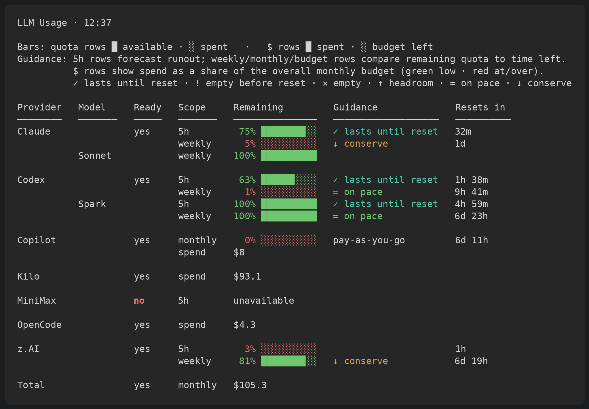

# llm-tools


[](https://github.com/chrisgleissner/llm-tools/actions/workflows/test.yml)
[](https://codecov.io/gh/chrisgleissner/llm-tools)
[](https://www.apache.org/licenses/LICENSE-2.0)
[](https://github.com/chrisgleissner/llm-tools/releases)

`llm-tools` is a small set of command-line tools for staying on top of local LLM provider capacity: session windows, weekly limits, quotas, credit balances, cost budgets, and provider availability.

The goal is to make LLM CLI work **more observable and less wasteful**. You can see which providers still have capacity, avoid burning weekly limits blindly, and dispatch tasks as soon as a provider becomes usable again instead of leaving open session windows idle.

The tools are intentionally **local- and CLI-first**. Instead of introducing another authentication layer, they use the provider CLIs you already have installed and authenticated. Credentials stay with those tools, and normal use remains zero-config.

Supported providers include: **Codex, Claude Code, GitHub Copilot, Kilo Code, MiniMax, OpenCode, and Z.ai**.

> Implementation and design detail (provider internals, environment knobs, invariants) lives in [AGENTS.md](./AGENTS.md). This README is the user-facing guide.

## Tools at a Glance

| Command         | Use it when you want to...                                                                       |
| --------------- | ------------------------------------------------------------------------------------------------ |
| `llm-usage`      | Check remaining LLM capacity before starting work.                                               |
| `llm-scheduler`  | Run one prompt through one selected provider once that provider has usable capacity.             |
| `ralph-robin`    | Keep autonomous work moving by rotating across providers instead of stopping at the first limit. |
| `llm-sleep-soak` | Prove suspend/resume is reliable on this machine before trusting unattended overnight runs.      |



## Install

Install with [pipx](https://pipx.pypa.io):

```bash
pipx install git+https://github.com/chrisgleissner/llm-tools.git
```

This puts the commands on your `PATH` and keeps the package in its own virtual environment. It also works on externally managed Python installations such as Debian, Ubuntu, and Homebrew Python.

If you do not have `pipx` yet:

```bash
python3 -m pip install --user pipx
python3 -m pipx ensurepath
```

On macOS, you can also use Homebrew:

```bash
brew install pipx
```

Open a new shell, then verify the commands are available:

```bash
command -v llm-usage
command -v llm-scheduler
command -v ralph-robin
```

Other install paths: a release wheel (`pipx install <wheel-url>` from the [releases page](https://github.com/chrisgleissner/llm-tools/releases)), a local checkout (`pipx install .`), or running the scripts straight from a checkout (`./llm-usage`, `./llm-scheduler`, `./ralph-robin`).

## Quick Start

Check current capacity:

```bash
llm-usage
llm-usage --watch 60
```

Keep a continuous low-overhead sampler running for instant reports and burn-down history:

```bash
llm-usage --service-install
llm-usage --service-status
llm-usage --service-stop
```

Run a prompt once a specific provider is ready:

```bash
llm-scheduler --provider codex --prompt-file task.md
```

Keep work moving across providers:

```bash
ralph-robin --prompt-file task.md
```

Follow the latest scheduler run:

```bash
tail -f ~/.cache/llm-tools/llm-scheduler/logs/latest/run.log
```

## Provider CLI Requirements

`llm-tools` drives the official command-line clients for each provider. Install and authenticate the CLI for each provider you want to use.

| Provider       | CLI binary | Install                                                                                                                   |
| -------------- | ---------- | ------------------------------------------------------------------------------------------------------------------------- |
| Claude Code    | `claude`   | [claude.com/product/claude-code](https://www.claude.com/product/claude-code) - `npm install -g @anthropic-ai/claude-code` |
| Codex          | `codex`    | [github.com/openai/codex](https://github.com/openai/codex) - `npm install -g @openai/codex`                               |
| GitHub Copilot | `copilot`  | [github.com/github/copilot-cli](https://github.com/github/copilot-cli) - `npm install -g @github/copilot`                 |
| Kilo Code      | `kilo`     | [kilo.ai](https://kilo.ai) - `npm install -g @kilocode/cli`                                                               |
| MiniMax        | `mmx`      | [platform.minimax.io](https://platform.minimax.io/) - `npm install -g mmx-cli`                                            |
| OpenCode       | `opencode` | [opencode.ai](https://opencode.ai/) - `npm install -g opencode-ai`                                                        |
| Z.ai (capacity)| _none_     | Capacity-only: zero-config — the key is read from Kilo's/OpenCode's `auth.json`; launch via Kilo (`zai/<model>`) — see [Z.ai](#zai-glm-via-kilo-or-opencode). |

You do not need every provider CLI installed.

* `llm-usage` reports unavailable providers as `unavailable` and still shows the rest.
* `llm-scheduler` only needs the provider selected with `--provider`.
* `ralph-robin` skips unavailable providers and rotates across the usable ones. Its default rotation is `claude,codex,opencode`; use `--providers` to change it.

## Capacity Scopes

`llm-tools` calls every quota-like constraint a **scope** — one capacity measure exposed by one provider. For example, Codex and Claude expose `5h` and `weekly` reset windows, while Kilo can expose a credit balance or monthly budget.

| Kind           | Resets? | Examples                             | Providers                       |
| -------------- | ------- | ------------------------------------ | ------------------------------- |
| `reset_window` | yes     | `5h`, `weekly`, `monthly`            | Codex, Claude, Copilot, MiniMax, Z.ai |
| `balance`      | no      | Kilo credit balance, GBP/USD/credits | Kilo, OpenCode                  |
| `budget`       | yes     | Monthly spend budget                 | Kilo, OpenCode                  |
| `ungated`      | n/a     | BYOK, local, ungated mode            | Kilo, OpenCode                  |
| `opaque`       | n/a     | Prepaid gateway subscription         | configured via routes           |

`llm-usage` shows one row per scope. `llm-scheduler` and `ralph-robin` can gate on a specific scope with `--scope`. `opaque` is capacity that exists but cannot be measured before launch (most commonly a prepaid gateway subscription); it is selected by a route — see [Route Mode](#route-mode).

Per-provider scope allow-lists:

| Provider       | Supported `--scope` values                     |
| -------------- | ---------------------------------------------- |
| Codex          | `auto`, `5h`, `weekly`                         |
| Claude Code    | `auto`, `5h`, `weekly`                         |
| MiniMax        | `auto`, `5h`, `weekly`                         |
| Z.ai           | `auto`, `5h`, `weekly`                         |
| GitHub Copilot | `auto`, `monthly`                              |
| Kilo Code      | `auto`, `balance`, `budget`, `byok`, `ungated` |
| OpenCode       | `auto`, `balance`, `budget`, `byok`, `ungated` |

## Configuration File

For shared settings across `llm-usage`, `llm-scheduler`, and `ralph-robin`, drop a TOML file at one of these locations (first match wins):

1. `$LLM_TOOLS_CONFIG` (explicit path)
2. `$XDG_CONFIG_HOME/llm-tools/config.toml`
3. `~/.config/llm-tools/config.toml`

A missing file is fine — the tools use their built-in defaults. **What wins when settings overlap:** built-in defaults < config file < CLI flags. Unknown sections or keys are rejected at load time so typos surface immediately.

The main thing the file sets is which model each provider runs, and what to do when that model's limit is used up:

```toml
# ~/.config/llm-tools/config.toml

[defaults]
# Order ralph-robin tries providers when --providers isn't given.
providers     = ["claude", "codex", "opencode"]
# Which capacity check to use: auto | 5h | weekly | monthly | balance | budget | byok | ungated
scope         = "auto"
# Minimum quota left before a provider is considered usable.
min_remaining = 1

[providers.claude]
model          = "sonnet"   # run `claude --model sonnet`; only run while Sonnet has capacity
# When Sonnet's limit is used up: false -> skip claude; true -> keep claude, let it pick another model
allow_fallback = false
#scope          = "weekly"   # optional per-provider override of [defaults]
#min_remaining  = 5

[providers.codex]
model          = "spark"
allow_fallback = false

[providers.opencode]
# Gate opencode on another provider's usage windows instead of its own — see capacity_provider below.
capacity_provider = "minimax"

[ralph]                                # ralph-robin-only settings (override [defaults])
providers      = ["claude", "codex", "kilo"]

[scheduler]                            # llm-scheduler-only settings (override [defaults])
provider       = "claude"
```

A complete template with every supported key (all commented out) ships at [config.example.toml](./config.example.toml). Copy it to one of the locations above and uncomment what you want.

**`model` / `allow_fallback`.** With `model` set, the tools call the provider with `--model NAME` and only run while that model has capacity. `allow_fallback = false` (default) treats the provider as unavailable once the model's limit is used up and moves to the next provider; `allow_fallback = true` keeps the provider but drops the model pin so its CLI picks another model. `--model NAME` on the command line overrides the file for a single run.

**`capacity_provider`.** Ties one provider's gating to another provider's usage windows (a single hop). The borrowing provider's own CLI is still launched — only the capacity reading is delegated. The motivating case is a CLI configured to run a different provider's model, such as OpenCode pointed at the MiniMax API, where OpenCode's own balance says nothing about whether a run will succeed. With `capacity_provider = "minimax"`, `ralph-robin` only routes to OpenCode while MiniMax has capacity, even-burns on MiniMax's remaining, and suspends until MiniMax's reset. Route mode's `delegate` policy is the successor to this setting (see below).

## Route Mode

By default `ralph-robin` rotates over **providers**, and each entry runs one model — the CLI's default, or the one pinned in `[providers.<name>]`. **Route mode** rotates over **routes** instead. A route binds a launch provider, a specific model, a capacity policy, and a cost policy into one schedulable unit — so a single CLI can serve several models in the same rotation (for example, one Kilo install running both MiniMax M3 and GLM 5.2). `--providers kilo` can only ever reach one Kilo model, because only a route carries a per-entry `model` pin.

### Turning it on

Set `[ralph].routes` in your config and plain `ralph-robin --prompt-file task.md` rotates over those routes. Pass `--routes a,b` to override the list for one run.

One gotcha: **`--providers` (`-P`) forces legacy provider mode and silently ignores your routes.** So `-P kilo` launches Kilo with its default model only, even when you have two Kilo routes configured.

```
# ✗ launches kilo with its default model only, ignoring [ralph].routes
ralph-robin --providers kilo --prompt-file task.md

# ✓ rotates both Kilo models, even-burning across whichever is usable
ralph-robin --routes kilo-minimax-m3,kilo-zai-glm-52 --prompt-file task.md
```

### Defining a route

```toml
[ralph]
routes = ["kilo-minimax-m3"]   # presence of this list enables route mode

[routes.kilo-minimax-m3]
provider       = "kilo"
model          = "kilo/minimax/minimax-m3"
allow_fallback = false

[routes.kilo-minimax-m3.capacity]
# How readiness is measured. One of:
#   provider        - read the provider's own snapshot (default)
#   provider_model  - model-aware (claude / codex have per-model buckets)
#   delegate        - launch this route's provider, read capacity from another
#   opaque          - capacity exists but cannot be measured before launch
#   ungated         - usable whenever the launch CLI is present
#   balance         - read the provider's balance scope
#   budget          - read the provider's budget scope
policy = "opaque"
scope  = "subscription"     # display name; defaults to "subscription"
label  = "MiniMax M3 via Kilo"

[routes.kilo-minimax-m3.cost]
# Display only; never affects readiness. One of:
#   included, fixed_subscription, metered_balance, metered_budget,
#   free, external, unknown
policy   = "fixed_subscription"
amount   = 20
currency = "USD"
period   = "monthly"
```

`llm-usage` renders this as:

```
Provider   Model       Ready   Scope          Remaining         Guidance              Resets in
Kilo       MiniMax M3  yes     subscription   prepaid USD20/mo   ✓ usable              -
```

`opaque` rows never show a percentage, balance, reset time, or progress bar. The `prepaid USD20/mo` text comes from the cost block; routes without a `fixed_subscription` cost render as `not metered`. The `delegate` policy replaces the legacy `capacity_provider` setting, and the selected `route_id` and launch provider are injected into the run's prompt so a handoff never stale-routes to the wrong provider.

### One CLI, several models

A route's `model` is what ralph-robin pins on the launch command, so two routes sharing a provider select different underlying models. **The pin must be an id from the CLI you launch, in `provider/model` form** (`kilo models` / `opencode models` list the exact ids). Two rules to respect:

- A bare model name is misparsed as a provider with an empty model and fails at launch with `Model not found: <name>/`.
- The `provider/` half is a credential namespace, and Kilo and OpenCode do **not** share it. Kilo's MiniMax path is `kilo/minimax/minimax-m3`; OpenCode's is `minimax-coding-plan/MiniMax-M3`. Cross-wiring them is not rejected up front — Kilo has no `minimax-coding-plan` credential, so it prints its banner and then **hangs forever** (no auth, no timeout) instead of erroring.

Here one Kilo install serves both models in a single even-burn rotation, each gated on its own real capacity:

```toml
[routes.kilo-minimax-m3]
provider = "kilo"
model    = "kilo/minimax/minimax-m3"
[routes.kilo-minimax-m3.capacity]
policy   = "opaque"       # entitlement lives behind the Kilo gateway; no pre-launch window
scope    = "subscription"

[routes.kilo-zai-glm-52]
provider = "kilo"
model    = "zai/glm-5.2"
[routes.kilo-zai-glm-52.capacity]
policy   = "delegate"     # gate on Z.ai's real 5h/weekly windows
provider = "zai"
```

### Mixing routes and bare providers

The route list also accepts **bare provider names**, which become implicit routes on their own CLI, gated on their own capacity. So you can burn down codex and claude alongside the Kilo routes without declaring `[routes.codex]` / `[routes.claude]`:

```
ralph-robin --routes codex,claude,kilo-minimax-m3,kilo-zai-glm-52 --prompt-file task.md
```

This rotates over four independent capacity pools and even-burns across whichever are usable.

## `llm-usage`

Use `llm-usage` before starting work, in status lines, or in scripts that need a compact view of local LLM capacity.

```bash
llm-usage
llm-usage --json
llm-usage --watch 60
llm-usage --statusline
```

Default output shows all supported providers, with one row per capacity scope:

```text
LLM Usage · 13:03

Bars: quota rows █ available · ░ spent   ·   $ rows █ spent · ░ budget left
Guidance: 5h rows forecast runout; weekly/monthly/budget rows compare remaining quota to time left.
          $ rows show spend as a share of the overall monthly budget (green low · red at/over).
          ✓ lasts until reset · ! empty before reset · × empty · ↑ headroom · = on pace · ↓ conserve

Provider   Model     Ready   Scope     Remaining         Guidance              Resets in
────────   ───────   ─────   ───────   ───────────────   ───────────────────   ──────────
Codex                yes     5h        90% █████████░    ✓ lasts until reset   4h 34m
                             weekly    34% ███░░░░░░░    ↓ conserve            5d 2h
           Spark             5h       100% ██████████    ✓ lasts until reset   4h 34m
                             weekly    96% █████████░    ↑ headroom            6d 1h

Claude               no      5h         0% ░░░░░░░░░░    × empty               36m
                             weekly    91% █████████░    ↑ headroom            5d
           Sonnet            weekly   100% ██████████    ↑ headroom            5d

Copilot              yes     monthly   36% ████░░░░░░    ↓ conserve            17d 11h
                             spend     $0.0 ░░░░░░░░░░    0% of $50

Kilo                 yes     spend    $12.4 ██░░░░░░░░    24.8% of $50

OpenCode             yes     spend     $4.3 █░░░░░░░░░    8.5% of $50

Budget               yes     monthly  $16.7 ███░░░░░░░    33.5% of $50          14d 17h
```

Cost is shown like quota: the amount sits on the left, followed by a bar — never a right-aligned `spent $X`. A `spend` row (distinct from a funded `balance`) reports money already spent this cycle. With an overall monthly budget configured, its bar fills with how much of that budget the spend consumes (green low, red at/over) and the trailing `Budget` row totals every provider's spend against the cap; without a budget the rows show just the amount and the total appears as a plain `Total` row. The `Total`/`Budget` row only sums spend that carries a known bounded cycle (month-to-date), so a long-running install doesn't inflate the cross-provider total.

The `Model` column only appears when a provider reports model-specific limits (e.g. Codex's `Spark`, Claude's per-model weekly). These sub-rows are informational — scheduling always gates on the provider's aggregate scopes.

### Copilot

Copilot reports two extras beyond the usual quota: a `monthly` row for your included premium-request allowance, and a `spend` row for add-on usage billed beyond it. Both come from the GitHub billing API using a token already on your machine (`COPILOT_GITHUB_TOKEN`, `GH_TOKEN`, `GITHUB_TOKEN`, or `gh auth token`) — no Copilot-specific credential. With no token the rows are simply omitted; they never affect `Ready`.

**Pay-as-you-go readiness.** Copilot keeps working past its included allowance via pay-as-you-go, up to the spending limit in your GitHub billing settings. GitHub does not expose that limit, so once the allowance is spent (`monthly` at 0%) `llm-usage` keeps Copilot `Ready` when overage is **funded** — either a limit you declare (`[copilot] monthly_spend_limit`, or `LLM_USAGE_COPILOT_SPEND_LIMIT`) or auto-detected when GitHub billing already shows overage being charged this month. When funded, the exhausted allowance row shows `pay-as-you-go` in the `Guidance` column instead of a misleading runout hint. (The CLI-footer parsing and GitHub-API fallback are detailed in [AGENTS.md](./AGENTS.md).)

### Table Columns

| Column      | Meaning                                                                                                                                            |
| ----------- | -------------------------------------------------------------------------------------------------------------------------------------------------- |
| `Model`     | The specific model a row reports on (e.g. `Spark`, `Sonnet`). Blank for a provider's aggregate rows. Only shown when model-specific data exists.   |
| `Ready`     | `yes` means every blocking scope for that provider has usable capacity now. `no` means at least one scope must reset or recover.                   |
| `Scope`     | The capacity measure, such as `5h`, `weekly`, `monthly`, `balance`, `budget`, or `spend` (money spent this cycle).                                  |
| `Remaining` | Remaining percentage, a `$` spend (with a bar when `[budget]` is set), a balance, or an unmetered state such as `byok`, `local`, or `ungated`.      |
| `Guidance`  | For `5h`, whether current burn should last until reset. For weekly/monthly/budget scopes, pace vs. a linear target. For `$` rows, share of budget. |
| `Resets in` | Relative reset time. Blank when the scope does not reset (`spend`/`balance`/`ungated`).                                                             |

Empty cells are intentional: a cell is left blank when it has nothing to report (a non-resetting scope, a window with no runout forecast). Only a real read failure is called out, as `unavailable`.

Set an overall monthly spend budget in `[budget]` (or the `LLM_USAGE_MONTHLY_BUDGET` / `LLM_USAGE_BUDGET_CURRENCY` env overrides) to turn every `spend` figure into a coloured progress bar against that cap, plus the `Budget` total row.

### `llm-usage` Options

| Option                   | Purpose                                                                                                 |
| ------------------------ | ------------------------------------------------------------------------------------------------------- |
| `-j`, `--json`           | Print stable JSON with `generated_at`, `codex`, `claude`, `copilot`, `kilo`, `opencode`, and `minimax`. |
| `-w`, `--watch SECONDS`  | Refresh continuously.                                                                                   |
| `-C`, `--show-copilot-credits` | Include Copilot AI credits when parseable.                                                        |
| `-S`, `--show-source`    | Show where each usage row came from.                                                                    |
| `-s`, `--hide-source`    | Hide the source column. This is the default.                                                            |
| `-R`, `--show-remaining-time` | Show burn-time estimates.                                                                          |
| `-r`, `--hide-remaining-time` | Hide burn-time estimates. This is the default.                                                    |
| `-D`, `--show-daily-budget` | Show the `Guidance` column. This is the default.                                                     |
| `-d`, `--hide-daily-budget` | Hide the `Guidance` column.                                                                          |
| `-K`, `--show-codex-spark` | Show Codex Spark rows.                                                                                |
| `-k`, `--hide-codex-spark` | Hide Codex Spark rows.                                                                                |
| `-M`, `--copilot-monthly-reset-offset-days DAYS` | Day offset from month start for Copilot monthly reset.                         |
| `-p`, `--provider-parallelism N` | Number of provider readers to run concurrently. Default: CPU cores; env: `LLM_USAGE_PROVIDER_PARALLELISM`. |
| `-t`, `--statusline`     | Read Claude Code statusline JSON from stdin and cache it.                                               |
| `-l`, `--log-only`       | Sample providers and append to the usage log without printing a table.                                  |
| `-n`, `--no-header`      | Omit the table header.                                                                                  |
| `--no-service`           | Read providers directly instead of using the local `llm-usage` service.                                 |
| `--service-install`      | Install and start the continuous sampler with the native user service manager.                          |
| `--service-uninstall`    | Stop and remove the installed continuous sampler.                                                       |
| `--service-start`        | Start the installed continuous sampler.                                                                |
| `--service-stop`         | Stop the installed continuous sampler.                                                                 |
| `--service-status`       | Show whether the local sampler is running.                                                             |
| `--service-run`          | Run the sampler in the foreground, useful for supervisors or debugging.                                 |
| `--service-interval SECONDS` | Continuous sampler refresh interval; default: `60`.                                                |
| `-h`, `--help`           | Show help.                                                                                              |

## `llm-scheduler`

Use `llm-scheduler` when you want one specific provider to run one specific prompt, but only after that provider has usable capacity. It is useful for delayed launches, rate-limit-aware retries, tmux launches, wake scheduling, and suspend-until-ready workflows.

```bash
llm-scheduler --provider codex --prompt-file task.md
llm-scheduler --provider claude --prompt "Continue the work in this repo until CI is green"
llm-scheduler --provider copilot --prompt-file task.md --retry-delays 60,180,600
```

Required form:

```bash
llm-scheduler --provider codex|claude|copilot|kilo|minimax (--prompt TEXT | --prompt-file FILE) [options]
```

Common examples:

```bash
llm-scheduler --provider codex --prompt-file task.md --at "23:05"          # run after a local time
llm-scheduler --provider codex --prompt-file task.md --tmux llm-work       # run inside tmux
llm-scheduler --provider codex --prompt-file task.md --wake                 # schedule a wake-up
llm-scheduler --provider claude --prompt-file task.md --scope 5h --suspend-until-ready
llm-scheduler --provider codex --prompt-file task.md --dry-run              # show the plan, don't launch
```

### Runtime Behavior

* In an interactive terminal, the provider is launched directly and output is written to `attempt-N.out`.
* In headless or non-terminal mode, the provider runs through a captured PTY.
* In tmux mode, the provider runs inside the requested tmux session or window.
* The scheduler exits after success, terminal failure, or retry exhaustion.

### `llm-scheduler` Options

| Option                                                              | Purpose                                                                                                                                            |
| ------------------------------------------------------------------- | -------------------------------------------------------------------------------------------------------------------------------------------------- |
| `-P`, `--provider PROVIDER`                                         | Provider: `codex`, `claude`, `copilot`, `kilo`, `opencode`, or `minimax`.                                                                          |
| `-p`, `--prompt TEXT`                                               | Prompt text.                                                                                                                                       |
| `-f`, `--prompt-file FILE`                                          | Read prompt from `FILE`, preserving content.                                                                                                       |
| `-a`, `--at TIME`                                                   | Delay launch until a `date -d` compatible local time.                                                                                              |
| `-a`, `--not-before TIME`                                           | Do not launch before a `date -d` compatible local time.                                                                                            |
| `-s`, `--scope auto\|5h\|weekly\|monthly\|balance\|budget\|byok\|ungated` | Capacity scope to gate on. Default: `auto`.                                                                                              |
| `-W`, `--window SCOPE`                                              | Deprecated alias for `--scope`.                                                                                                                    |
| `-m`, `--min-remaining PERCENT`                                     | Minimum remaining capacity required to launch. Default: `1`.                                                                                       |
| `-i`, `--poll-interval SECONDS`                                     | Usage polling interval. Default: `60`.                                                                                                             |
| `-u`, `--max-unavailable-wait SECONDS`                              | Maximum wait when usage cannot be measured. Default: `900`. Use `0` to wait forever. Known reset times still wait for reset.                       |
| `-r`, `--retry-delays LIST`                                         | Retry delays. Default: `60,180,600`.                                                                                                               |
| `-R`, `--no-retry`                                                  | Disable retries.                                                                                                                                   |
| `-C`, `--cwd DIR`                                                   | Set provider working directory.                                                                                                                    |
| `-F`, `--fresh`                                                     | Launch a fresh foreground provider process. This is the default.                                                                                   |
| `-H`, `--headless`                                                  | Force non-interactive provider command and captured PTY.                                                                                           |
| `-T`, `--tmux SESSION[:WINDOW]`                                     | Run through tmux.                                                                                                                                  |
| `-e`, `--command-template TEMPLATE`                                 | Override provider syntax. Supports `{provider}`, `{prompt}`, `{prompt_file}`, and `{cwd}`. Parsed with Python `shlex`, not a shell.                    |
| `-y`, `--auto-confirm`                                              | Auto-confirm recognised safe trust prompts. This is the default.                                                                                   |
| `-Y`, `--no-auto-confirm`                                           | Disable safe auto-confirmation.                                                                                                                    |
| `-I`, `--headless-idle-timeout SECONDS`                             | Abort headless fresh mode after no output progress. Default: `600`. Use `0` to disable.                                                            |
| `-Q`, `--headless-question-timeout SECONDS`                         | Abort headless fresh mode after question-like output stalls. Default: `30`. Use `0` to disable.                                                    |
| `-L`, `--log-dir DIR`                                               | Set scheduler log root.                                                                                                                            |
| `-O`, `--run-dir DIR`                                               | Write or resume a specific run directory.                                                                                                          |
| `-d`, `--dry-run`                                                   | Resolve usage, timing, command plan, and logs without launching.                                                                                   |
| `-k`, `--wake`                                                      | Enable best-effort wake scheduling.                                                                                                                |
| `-U`, `--suspend-until-ready`                                       | Schedule a resumed run, enable wake, suspend the machine, and continue after wake.                                                                 |
| `-x`, `--wake-test`                                                 | Print wake diagnostics without scheduling work.                                                                                                    |
| `-h`, `--help`                                                      | Show help.                                                                                                                                         |

### Default Provider Commands

| Provider       | Interactive                    | Headless                             |
| -------------- | ------------------------------ | ------------------------------------ |
| Codex          | `codex -C <cwd> <prompt>`      | `codex exec -C <cwd> <prompt>`       |
| Claude Code    | `claude <prompt>`              | `claude --print <prompt>`            |
| GitHub Copilot | `copilot -C <cwd> -i <prompt>` | `copilot -C <cwd> --prompt <prompt>` |
| Kilo Code      | `kilo run <prompt>`            | `kilo run --dir <cwd> <prompt>`      |
| OpenCode       | `opencode`                     | `opencode run --dir <cwd> <prompt>`  |
| MiniMax        | `mmx`                          | `mmx run --auto -C <cwd> <prompt>`   |
| Z.ai           | _launch via a route_           | _launch via a route_                 |

Kilo Code and OpenCode accept `-m, --model <provider>/<model>`; the scheduler and Ralph inject this flag when the per-provider policy or route pins a model (e.g. `-m zai/glm-4.7`). No permission-bypassing flag is injected — whether a headless run may act without prompting is governed by each tool's own permission config. Interactive Kilo, OpenCode, and MiniMax inherit the working directory from the launching process. To override Claude Code's settings for one run, use `--command-template`, e.g. `claude --permission-mode plan --print {prompt}`.

## `ralph-robin`

Use `ralph-robin` when the task matters more than which provider runs it. It runs a [Ralph loop](https://venturebeat.com/technology/how-ralph-wiggum-went-from-the-simpsons-to-the-biggest-name-in-ai-right-now/): a persistent autonomous workflow that keeps going instead of stopping when one provider reaches a limit, stalls, or becomes temporarily unusable. That makes it useful for long-running coding, repair, hardening, documentation, and investigation tasks.

`ralph-robin` wraps `llm-scheduler` and rotates across configured providers. It can either keep using the current provider until exhausted, or spread work so provider limits burn down at a similar rate — **even burn-down is the default**. When it selects Claude Code, it renders Claude's `stream-json` output as readable stdout (assistant text, tool calls, and results appear live).

```bash
ralph-robin --prompt-file task.md
ralph-robin --prompt "Continue until tests pass"
ralph-robin --providers claude,codex,copilot,kilo,minimax --prompt-file task.md
ralph-robin --prompt-file task.md --tmux llm-work
ralph-robin --prompt-file task.md --dry-run
```

Example output:

```text
ralph-robin --prompt-file /home/chris/dev/ralph.prompt.md
[16:22:47] ◆ ralph-robin: · logs: /home/chris/.cache/llm-tools/ralph-robin/logs/20260613-162247-ralph-robin-r67_na63
[16:22:47] ◆ ralph-robin: · usage claude: usable (5h 22% left, weekly 85% left) | codex: usable (5h 99% left, weekly 35% left)
[16:22:47] ◆ ralph-robin: ✓ selected claude (even-burn)
[16:22:52 claude] I'll begin the RALPH loop iteration following FAST-PATH STARTUP. Let me start by establishing current state.
[16:22:54 claude] Tool call: Bash
```

Each relayed provider line is prefixed with `[time provider]` by default, so a quiet increment is distinguishable from a wedged one. Customize with `--prefix time,provider,usage` or disable with `--prefix none`.

### `ralph-robin` Options

| Option                                                              | Purpose                                                                                                                                                       |
| ------------------------------------------------------------------- | ------------------------------------------------------------------------------------------------------------------------------------------------------------- |
| `-P`, `--providers LIST`                                            | Set comma-separated provider rotation. Values include `claude`, `codex`, `copilot`, `kilo`, `opencode`, and `minimax`.                                       |
| `-p`, `--prompt TEXT`                                               | Prompt text passed to the selected provider.                                                                                                                  |
| `-f`, `--prompt-file FILE`                                          | Prompt file passed to the selected provider.                                                                                                                  |
| `-s`, `--scope auto\|5h\|weekly\|monthly\|balance\|budget\|byok\|ungated` | Capacity scope to gate on. Default: `auto`.                                                                                                         |
| `-W`, `--window SCOPE`                                              | Deprecated alias for `--scope`.                                                                                                                              |
| `-m`, `--min-remaining PERCENT`                                     | Minimum remaining capacity required to launch. Default: `1`.                                                                                                  |
| `-i`, `--poll-interval SECONDS`                                     | Poll interval passed to `llm-scheduler`. Default: `60`.                                                                                                      |
| `-u`, `--max-unavailable-wait SECONDS`                              | Bound inconclusive usage waits before optimistic launch. Default: `900`; `0` waits forever.                                                                  |
| `-r`, `--retry-delays LIST`                                         | Retry delays. Default: `60,180,600`.                                                                                                                          |
| `-R`, `--no-retry`                                                  | Disable retries.                                                                                                                                              |
| `-e`, `--even-burn`                                                 | Spread work to burn provider quota down evenly. Enabled by default.                                                                                           |
| `-E`, `--no-even-burn`                                              | Keep using the current provider until it is exhausted.                                                                                                        |
| `-n`, `--max-iterations N`                                          | Stop after `N` successful increments. Default `0` means no iteration cap. Use `1` for single-shot.                                                            |
| `-D`, `--max-duration D`                                            | Stop once `D` of wall-clock time elapses, such as `24h`, `90m`, `30s`, or seconds. Default: `24h`. Use `0` to disable. Whichever limit is reached first wins. |
| `-I`, `--min-iteration-seconds N`                                   | Minimum runtime floor for successive increments. Default: `5`; `0` disables.                                                                                  |
| `-x`, `--prefix LIST`                                               | Comma-separated fields stamped on each relayed provider line. Fields: `time`, `provider`, `usage`. Default: `time,provider`. Use `none` or an empty value to disable. |
| `-X`, `--prefix-usage-interval S`                                   | Refresh interval in seconds for the cached `usage` prefix field. Default: `15`. Use `0` to refresh every line.                                                |
| `-C`, `--cwd DIR`                                                   | Set provider working directory.                                                                                                                               |
| `-F`, `--fresh`                                                     | Launch a fresh provider process through `llm-scheduler`.                                                                                                      |
| `-H`, `--headless`                                                  | Force non-interactive provider command and captured PTY.                                                                                                      |
| `-T`, `--tmux SESSION[:WINDOW]`                                     | Execute through tmux via `llm-scheduler`.                                                                                                                     |
| `-g`, `--command-template TEMPLATE`                                 | Override provider syntax. Supports `{provider}`, `{prompt}`, `{prompt_file}`, and `{cwd}`.                                                                        |
| `-y`, `--auto-confirm`                                              | Auto-confirm recognised safe trust prompts. This is the default.                                                                                              |
| `-Y`, `--no-auto-confirm`                                           | Disable safe auto-confirmation.                                                                                                                               |
| `-q`, `--headless-idle-timeout SECONDS`                             | Abort headless fresh mode after no output progress. Default: `600`. Use `0` to disable.                                                                       |
| `-Q`, `--headless-question-timeout SECONDS`                         | Abort headless fresh mode after question-like output stalls. Default: `30`. Use `0` to disable.                                                               |
| `-S`, `--state-file FILE`                                           | Store current provider index. Default: `${XDG_CACHE_HOME:-$HOME/.cache}/llm-tools/ralph-robin/state.json`.                                                    |
| `-L`, `--log-dir DIR`                                               | Set Ralph log directory. Default: `${XDG_CACHE_HOME:-$HOME/.cache}/llm-tools/ralph-robin/logs`.                                                               |
| `-k`, `--wake`                                                      | Pass best-effort wake scheduling to `llm-scheduler`.                                                                                                          |
| `-U`, `--suspend-until-ready`                                       | Suspend even for the selected provider's own wait gates.                                                                                                     |
| `--watchdog`                                                       | Arm a hardware watchdog across each machine suspend so a wedged resume reboots instead of hanging. See [Reliable sleep/wake](#reliable-sleepwake).            |
| `-d`, `--dry-run`                                                   | Resolve rotation and usage state without submitting.                                                                                                          |
| `-h`, `--help`                                                      | Show help.                                                                                                                                                    |

Scope, retry, launch, and headless-timeout options (`-s`, `-m`, `-i`, `-u`, `-r`, `-R`, `-C`, `-F`, `-H`, `-T`, `-g`, `-y`, `-Y`, `-q`, `-Q`) are passed straight through to `llm-scheduler`.

### Behavior

`ralph-robin` owns the full rotation loop: provider selection, retries, waiting, suspend decisions, and handoff between providers. It starts each increment in autonomous headless mode (even from an interactive terminal), re-evaluates capacity before each increment, and re-submits the same prompt so long-running work continues across provider boundaries.

**Provider selection.** By default ralph-robin uses even burn-down: among ready providers it prefers the one with the most pace-adjusted headroom in its long-period plan scopes (`weekly`, `monthly`, Kilo `budget`), scoring each by its most-constrained plan scope so a draining weekly hands over instead of running to the floor. The short `5h` window still gates usability but does not drive ranking. Providers with no rankable plan scope — such as an opaque prepaid subscription like MiniMax M3 via Kilo — take fair turns by least-completed count, so they are neither starved nor allowed to monopolise the loop. Use `--no-even-burn` to stay on one provider until it is exhausted.

**Blocking and recovery.** ralph-robin does not stop just because every provider is currently blocked — it waits or suspends until the rotation can recover. The loop ends only on a non-recoverable failure, a degenerate instant-success streak, `--max-duration`, or `--max-iterations`. If a provider's usage cannot be measured, Ralph tries it before suspending; if a provider hits a scheduler autonomy abort, Ralph skips it for the current invocation and tries the next.

### Reliable sleep/wake

An overnight Ralph run waits out reset windows by suspending the whole machine — safe only if the box reliably resumes, and only sensible if nothing else suspends it mid-run. Ralph handles both, portably:

* **Defers your OS auto-suspend.** For its whole run Ralph holds a logind `idle` inhibitor (`systemd-inhibit --what=idle`) so a desktop idle timer (KDE PowerDevil, GNOME, logind's `IdleAction`) cannot suspend the machine mid-iteration. An `idle` inhibitor does not block Ralph's own deliberate, RTC-armed suspends, so you do not have to change your auto-suspend settings.
* **Never suspends without an armed wake.** Ralph arms an RTC wake (`rtcwake -m no` when it can, otherwise a `systemd-run --user` `WakeSystem=true` timer) before every suspend. If it cannot arm one, it waits awake instead.
* **Verifies wakes by behaviour.** After resume it checks how far the wall clock landed from target; an unreliable wake latches Ralph to awake-only for the rest of that run rather than risk repeating a bad cycle.
* **Caps suspend churn** with a minimum awake interval and an optional per-run cap, and writes a durable fsync'd ledger so a wedged resume that forced a hard reset is reported on the next start.
* **`--watchdog` (opt-in)** arms a hardware watchdog across each suspend so a hung resume reboots the machine instead of hanging. This needs a `/dev/watchdog` whose timer keeps counting across S3; without one it is a logged no-op.

The suspend backend is feature-detected (systemd today) and degrades to an awake wait where the tools are missing. Tuning knobs (`LLM_TOOLS_NO_INHIBIT`, `LLM_TOOLS_SUSPEND_DRIFT_TOLERANCE`, `LLM_RALPH_MIN_AWAKE_SECONDS`, `LLM_RALPH_MAX_SUSPENDS`, `LLM_SCHEDULER_SUSPEND_MIN_LEAD`, `LLM_TOOLS_WATCHDOG_DEVICE`) are documented in [AGENTS.md](./AGENTS.md). Run `llm-scheduler --wake-test` to see what your host supports.

When all providers are blocked, Ralph sets an RTC wake for the earliest known reset across the rotation and resumes its own loop after wake. This differs from `llm-scheduler --suspend-until-ready`, which wakes into one selected provider — Ralph wakes back into cross-provider rotation.

### `llm-sleep-soak` — prove sleep/wake is reliable

Before trusting unattended overnight runs, soak-test the exact suspend/wake path on your hardware:

```bash
llm-sleep-soak --cycles 50 --period 90s        # 50 real suspend/wake cycles
llm-sleep-soak --cycles 20 --period 2m --watchdog --json
```

Each cycle suspends the machine, wakes it via the same verified RTC path Ralph uses, measures wake drift, scrapes the kernel log for resume errors, and records the cycle in the durable ledger. It prints a `PASS`/`FAIL` summary and exits non-zero if any cycle resumed late or logged an error — or if an earlier run left a cycle unfinished (the fingerprint of a past wedged resume).

This is a **real-hardware test**: it genuinely suspends the machine and cannot run in CI. `LLM_SCHEDULER_NO_ACTUAL_SUSPEND=1` runs the whole loop in simulation (no real sleep) if you just want to see the flow.

## Provider Setup Details

Most providers only need their CLI installed and authenticated once. Kilo, MiniMax, and Z.ai also support environment-variable fallbacks, useful for CI and deterministic tests.

### Kilo Code

Kilo is driven primarily through its CLI, with environment variables as a CI/test fallback:

| Variable                           | Purpose                                                                   |
| ---------------------------------- | ------------------------------------------------------------------------- |
| `LLM_USAGE_KILO_MODE`              | `gateway` (default), `budget`, `byok`, `local`, or `ungated`.             |
| `LLM_USAGE_KILO_BALANCE`           | Remaining credit balance. Required for `balance` scope.                   |
| `LLM_USAGE_KILO_CURRENCY`          | Currency or unit label, such as `GBP`, `USD`, or `credits`.               |
| `LLM_USAGE_KILO_MIN_BALANCE`       | Minimum remaining balance required to consider Kilo usable. Default: `1`. |
| `LLM_USAGE_KILO_MONTHLY_BUDGET`    | Total monthly budget. Enables `budget` scope.                             |
| `LLM_USAGE_KILO_MONTHLY_SPENT`     | Amount already spent in this budget period.                               |
| `LLM_USAGE_KILO_MONTHLY_RESET_DAY` | Day of month the budget resets. Default: `1`.                             |

When `kilo` is on `PATH`, the tools try `kilo stats` (JSON or text) first and fall back to the variables above. The monetary `spend` row is an exact month-to-date sum from Kilo's local database rather than a rolling `--days N` approximation. With `--scope auto`, Kilo prefers `budget`, then `balance`, then `ungated`.

**Gateway-backed models (e.g. MiniMax M3 via Kilo).** When Kilo sells another provider's model through its gateway, the entitlement lives behind the Kilo gateway and cannot be measured before launch — model it as an `opaque` route, pinned to an id from Kilo's own catalogue (`kilo/minimax/minimax-m3`). See [Route Mode](#route-mode) for the full config; the legacy `capacity_provider` setting is for the *truthful* delegation case only.

### Z.ai (GLM via Kilo or OpenCode)

Z.ai is a capacity-only provider: there is no `zai` CLI, only the GLM family (`GLM-4.7`, `GLM-5.2`, …) served through Kilo (or OpenCode) via the `zai/<model>` id. `llm-usage` reads your Z.ai `5h`/`weekly` quota directly from the official monitoring API; `llm-scheduler` / `ralph-robin` launch the configured provider with `-m zai/<model>` through a route with `capacity.policy = "delegate"` and `provider = "zai"` (see [Route Mode](#route-mode)).

**Zero-config key discovery.** You do not configure a Z.ai key in `llm-tools`. When you authenticate Z.ai in Kilo (or OpenCode), the key is stored in that agent's owner-only `auth.json`; the reader discovers it there automatically, so adding a Z.ai account to Kilo lights up the dashboard row with no further setup. A bad or missing key reads as `not-authenticated` (rather than a generic `unavailable`), so "wrong key" is distinguishable from "API down". The environment variables below are an explicit override / hermetic-test path, not required.

| Variable                          | Purpose                                                            |
| --------------------------------- | ------------------------------------------------------------------ |
| `ZAI_API_KEY`                     | Bearer token override (takes precedence over the discovered key).  |
| `LLM_USAGE_ZAI_API_KEY`           | Same, but overrides `ZAI_API_KEY` (mainly for tests).              |
| `LLM_USAGE_ZAI_MODEL`             | Display-only GLM pin (e.g. `zai/glm-4.7`); does not affect gating. |
| `LLM_USAGE_ZAI_5H_PERCENT` / `..._RESET_EPOCH` | Hermetic fallback for the 5h window (percent `0..100`, epoch s/ms). |
| `LLM_USAGE_ZAI_WEEKLY_PERCENT` / `..._RESET_EPOCH` | Hermetic fallback for the weekly window.                     |
| `LLM_USAGE_ZAI_TIMEOUT`           | HTTP timeout in seconds. Default `10`.                             |

```bash
# Single GLM model on Kilo, gated on Z.ai's 5h quota.
llm-scheduler --provider kilo --model zai/glm-4.7 --prompt-file task.md --scope 5h

# Even-burn across two GLM models on Kilo, gated on Z.ai's real windows.
ralph-robin --routes kilo-zai-glm-4-7,kilo-zai-glm-5-2 --prompt-file task.md
```

Launching Z.ai directly via `--provider zai` is rejected — it has no CLI to run; always go through a route. `llm-usage --json` emits a `zai` top-level key with the parsed `5h` and `weekly` scopes. (The API endpoints, payload classification, and China-mirror fallback are detailed in [AGENTS.md](./AGENTS.md).)

### MiniMax

MiniMax quota is read from the local `mmx` CLI (`mmx quota show --output json`), with environment variables as a fallback for tests:

| Variable                               | Purpose                                                            |
| -------------------------------------- | ------------------------------------------------------------------ |
| `LLM_USAGE_MINIMAX_5H_PERCENT`         | Remaining percentage for the 5h session window, from `0` to `100`. |
| `LLM_USAGE_MINIMAX_5H_RESET_EPOCH`     | Epoch seconds or milliseconds when the 5h window resets.           |
| `LLM_USAGE_MINIMAX_WEEKLY_PERCENT`     | Remaining percentage for the weekly window, from `0` to `100`.     |
| `LLM_USAGE_MINIMAX_WEEKLY_RESET_EPOCH` | Epoch seconds or milliseconds when the weekly window resets.       |
| `LLM_USAGE_MINIMAX_MODEL`              | `model_remains` row to read. Default: `general`.                   |
| `LLM_USAGE_MINIMAX_TIMEOUT`            | Timeout for `mmx quota show`, in seconds. Default: `10`.           |

MiniMax exposes the same `5h` and `weekly` reset windows as Claude Code and Codex, so it renders and gates identically. The row appears only when the `mmx` CLI is installed or MiniMax environment variables are set.

## Logs and Cache

Runtime data lives under `${XDG_CACHE_HOME:-$HOME/.cache}/llm-tools`:

```text
llm-tools/llm-usage/                 Usage caches and llm-usage.log
llm-tools/llm-usage/service/         Local service latest snapshot, history JSONL, logs
llm-tools/llm-scheduler/logs/        Per-run scheduler logs
llm-tools/ralph-robin/               Ralph state and logs
```

Each scheduler run directory contains `run.log`, `events.jsonl`, `prompt.txt`, and `attempt-N.out` / `attempt-N.status`. The scheduler logs arguments, prompt source and SHA-256, usage snapshots, wait decisions, the command plan, output, exit code, and final status. Convenience symlinks point at the latest runs:

```text
~/.cache/llm-tools/llm-scheduler/logs/latest
~/.cache/llm-tools/llm-scheduler/logs/latest-claude
~/.cache/llm-tools/llm-scheduler/logs/latest-codex
```

## Data Sources

`llm-tools` reads local provider state where possible, and **actively refreshes** every provider on each run — it never just echoes a stale session log. Each reader asks the provider for current numbers and only falls back if that fails:

| Provider       | Active refresh → fallback                                                   |
| -------------- | --------------------------------------------------------------------------- |
| Codex          | `codex app-server` (live, turn-free) → last cached payload → local session JSONL |
| Claude Code    | OAuth usage API (auto-refreshing the token) → API cache → statusline cache → project JSONL |
| GitHub Copilot | Background PTY footer capture → cached capture → GitHub billing API          |
| Kilo / MiniMax / OpenCode | `kilo stats` / `mmx quota show` / `opencode stats` → environment variables |

A provider only reports `stale-usage` if it cannot be refreshed for a known authentication or CLI-startup reason (e.g. Codex `not-authenticated` or `missing-cli`). When the CLI is installed and signed in, you always see live data. `llm-usage` reads providers concurrently — configure fan-out with `--provider-parallelism` or `LLM_USAGE_PROVIDER_PARALLELISM` (default: CPU cores).

### Local Service

By default a one-shot `llm-usage` first asks the local Unix-socket service for a snapshot; if no continuous service is running it starts the sampler ephemerally, reads one snapshot, and shuts it down, falling back to direct reads if the service can't start. For instant reports and continuous burn-down history, install the sampler as a native user service:

```bash
llm-usage --service-install
llm-usage --service-status
llm-usage --service-uninstall
```

On Linux this writes a `systemd --user` unit; on macOS a launchd LaunchAgent. The service is local-only: a Unix-domain socket under `${XDG_RUNTIME_DIR:-/tmp/llm-tools-$UID}`, `latest.json` and `history.jsonl` under the cache dir, and no HTTP listener, database, telemetry, or extra dependency. Use `--no-service` for an explicit direct read.

### GitHub Copilot

The Copilot footer only shows plan/session usage when the `quota` and `ai-used` status-line items are enabled. These are off on a fresh install, so before each capture `llm-usage` enables them in `${COPILOT_HOME:-~/.copilot}/settings.json` (all other settings preserved). Set `LLM_USAGE_COPILOT_NO_SETTINGS_WRITE=1` to skip that write.

Capture is cached with `LLM_USAGE_COPILOT_CACHE_TTL` (default `300`; `0` forces synchronous capture) because the PTY footer capture is slow and occasionally flaky — a refresh that can't complete in its budget shows the most recent figure and refreshes in the background. To override the monthly allowance denominator, set `LLM_USAGE_COPILOT_PLAN` (e.g. `pro_plus`) or pin `LLM_USAGE_COPILOT_MONTHLY_ALLOWANCE`. The full set of Copilot knobs is catalogued in [AGENTS.md](./AGENTS.md).

## Appearance and Output Customization

Override colors and symbols with environment variables:

```bash
LLM_TOOLS_COLOR_ERROR='1;34'     # one color role
LLM_TOOLS_SYMBOL_ERROR=!         # one symbol role
LLM_TOOLS_NO_SYMBOLS=1           # disable symbols, keep color
```

Color roles: `BRAND, INFO, OK, WARN, ERROR, DIM, DIFF_ADD, DIFF_REMOVE, DIFF_HUNK, COMMAND, TOOL, STDERR, HEADING`. Colors are disabled automatically for non-TTY output, `TERM=dumb`, `NO_COLOR`, or `LLM_USAGE_NO_COLOR`.

Ralph-launched provider processes inherit `LLM_TOOLS_RALPH_ROBIN_ACTIVE=1`, `..._SELECTED_PROVIDER`, and `..._PROVIDERS`. If a child tries to run `llm-scheduler --suspend-until-ready` while Ralph is active, the scheduler exits with status `75` instead of suspending — Ralph remains the single rotation and suspend coordinator.

## Requirements

* Linux or macOS.
* Python 3.11 or newer.
* Optional: `tmux` for tmux mode.
* Optional: `systemd-run` or `rtcwake` for wake support.

Wake and suspend features (`--wake`, `--suspend-until-ready`) require Linux with systemd. The tool never modifies BIOS/UEFI settings and never silently requires `sudo`. Wake reliability depends on firmware, motherboard RTC support, the kernel, systemd user timers, and power state — run `llm-scheduler --wake-test` for diagnostics. Everything else works on Linux and macOS.

## Limitations

* Uses local data and locally authenticated CLIs only. Not an official billing dashboard.
* Missing or inconclusive provider data is shown as `-`, `unknown`, or `unavailable`.
* If usage stays unavailable beyond `--max-unavailable-wait`, the scheduler launches optimistically and lets provider rate-limit handling and retry behavior take over.
* Provider local data formats and CLI syntax can change.
* Copilot AI credits are parsed when requested, but scheduler gating uses monthly remaining usage.

## Tests

```bash
python -m pip install -e . pytest coverage
coverage run -m pytest
coverage combine
coverage report --fail-under=85
```

Tests use fixtures and mock commands. They do not require real provider installations, credentials, network access, or the user's real home directory. For manual end-to-end checks, run the examples above against installed and authenticated providers.

## Contributing

Small, focused pull requests are welcome. Before opening a PR, make sure total coverage is at or above `85%`:

```bash
coverage run -m pytest && coverage combine && coverage report --fail-under=85
```

Adding a new provider follows a small adapter contract — see the provider-adapter steps and implementation map in [AGENTS.md](./AGENTS.md).

## License

Apache License 2.0.
